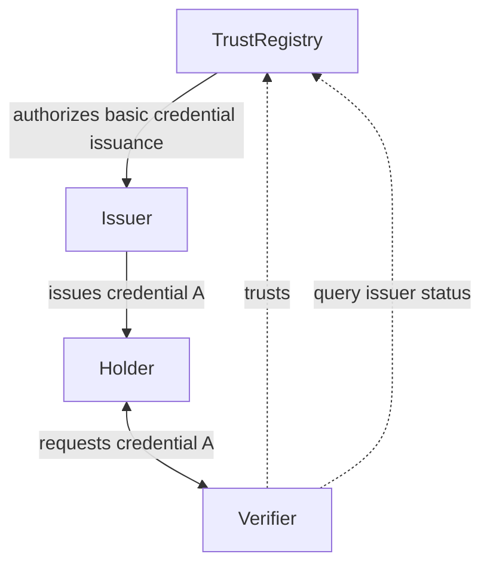
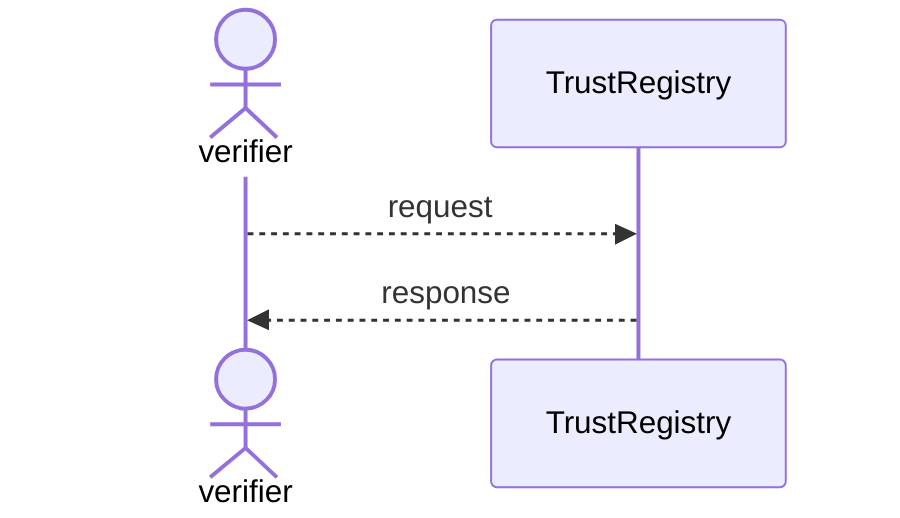

# TRQP User Guide

The following is a companion guide to help developers/implementers implement the Trust Registry Query Protocol (TRQP).
This is a non-normative document. 

## The TRQP Is a Bridge

The TRQP is NOT meant to replace an exiting `intra-trust framework`, such as Open ID Federation, X509 Chains, EBSI Trust
Chains, TRAIN, or other types of frameworks. The TRQP is meant to be a bridge across frameworks. Therefore, it must
speak the lowest common denominator across trust frameworks. The TRQP, is what we call a `inter-trust framework`. It is
intended to establish trust _across_ ecosystems and trust frameworks. 

It does so by answering the fundamental question: `"Does Entity X have Authorization Y, in the context of Ecosystem
Governance Framework Z?".`. Put another way, the TRQP is answering the a quesition about whether a particular _subject_,
has an _authorization_, under a specific ecosystem governance framework (EGF). For example, a question that the TRQP may
facilitate is, during a presentation exchange: "Is _issuer X_ authorized to issue credential `Y` under this ecosystem
`Z`". 

We call this the triples model, and you see some examples
[here](https://docs.google.com/spreadsheets/d/1AHuUrkcl7pN-AvBTM5tO6xiJTs6oOBmNI1yZH8BmHco/edit?gid=0#gid=0). 

When we bridge across ecosystems, we develop adapters specific to the ecosystem. For example, in the diagram below:


The TRQP bridges many different types of systems, because it abstracts the _intra-trust framework_ into a more general
_intra-trust framework_. This is very important. As an implementer, you _MUST_ develop your own opinions about how to
develop trust intra-ecosystem. A list of resources to understand to help you design your trust system can be found
[here](https://github.com/andorsk/awesome-trust-registries).

### 4 Things to Take Away 

- The TRQP does NOT replace your `intra-ecosystem trust framework`. It is a complement. 
- The TRQP is a bridge across various trust frameworks and agnostic to a particular intra-trust method. 
- The TRQP does NOT specify how you develop your `inter-trust` bridge. That is for you to figure out ( but this guide
  can give some suggestions ).
- The TRQP is meant to answer one question: `"Does Entity X have Authorization Y, in the context of Ecosystem Governance
  Framework Z?".` 

## Core Requirements Of Implementing The TRQP. A Trust Registry capable of Serving the Authorization State of the Ecosystem. 

Within your ecosystem, one of the fundamental requirements is a way for an trust regisry to have the capability to
discover the state of the authorization space within it's scope. The trust registry serves as an authoritative source
for the ecosystem. 

This means that while your methods may be decentralized, the ecosystem trust registry MUST have knowledge about the
`authorization`, the `entity`, and how to share the state of the entities authorization within it's own governance
framework. 

A critical distinction to make is that a trust registry is NOT an ecosystem. A trust registry is a capability of an
ecosystem. 

The TRQP is supported by **_profiles_**. Profiles describe the transports and data models used to achieve technical
interoperability. For example, a profile may describe identifiers as a URI, metamodels with certain data models,
specific encodings, and describe the transports required for technical interopability. Another profile may describe a
DIDComm based transport with DID based identifiers and an entirely different metamodel. 

The expectation is that as time moves on, the ecosystems will converge on specific profiles that promote interopability,
in the same way that we mostly charge with USB-C now because of the convergence on connector profiles. The TRQP
specification supports the general requirements of the profile, but does not establish the same opinionations a profile
will have. 

### Three Things To Take Away 

- A trust registry MUST have a way to represent the state of authorizations within the ecosystem. It is up to the
  ecosystem to figure out how to bubble the information up to the Trust Registry. The Trust Registry serves as an
  authoritative source for an ecosystem. 
- The Trust Registry Query Protocol defines the base requirements for a technical interoperability profile. The
  technical interoperability profile defines the specifics such as transports, data models, and identifiers. 

## Standard Interaction Patterns

### Simple Structure ( Case A )

Simple structure is a single trust registry with a shallow network. In this case, the Trust Registry provides an
authorization to issuer to a basic credential, which the verifier looks up the authorization over the Trust Registry API
endpoints via TRQP. 



In the single hop case, the verifier simply queries the trust registry and gets a response back. 



## Brigde Example : Open ID Federation

Let's take an example of OIDF. If you would like to implement a OIDF Bridge into the TRQP, the OIDF ecosystem MUST have
awarnness of the authorization states of the OIDF ecosystem. How that is to be done is up to the OIDF ecosystem, but
here's an example of _how_ it may be done. This is non-normative and meant purely to demonstrate an example. 

Let's take the example from the Open ID Federation Specification:

```txt
-----------------.            .-----------------.
|  Trust Anchor A |            |  Trust Anchor B |
'------.--.-------'            '----.--.--.------'
       |  |                         |  |  |
    .--'  '---. .-------------------'  |  |
    |         | |                      |  |
.---v.  .-----v-v------.   .-----------'  |
| OP |  | Intermediate |   |              |
'----'  '--.--.--.-----'   |    .---------v----.
           |  |  |         |    | Intermediate |
   .-------'  |  '------.  |    '---.--.--.----'
   |          |         |  |        |  |  |
.--v-.      .-v--.     .v--v.   .---'  |  '----.
| RP |      | RS |     | OP |   |      |       |
'----'      '----'     '----'   |   .--v-.   .-v--.
                                |   | RP |   | RP |
                                |   '----'   '----'
                                |
                        .-------v------.
                        | Intermediate |
                        '----.--.--.---'
                             |  |  |
                       .-----'  |  '----.
                       |        |       |
                    .--v-.   .--v-.   .-v--.
                    | OP |   | RP |   | AS |
                    '----'   '----'   '----'
 ```

On issuance, a holder in the OIDF ecosystem may have a signed JWT claim set anchored to the Trust Anchor. For example,
the entity claim set may look like this:

```json
{
  "authority_hints": [
    "https://umu.se"
  ],
  "exp": 1568397247,
  "iat": 1568310847,
  "iss": "https://op.umu.se",
  "sub": "https://op.umu.se",
  "jwks": {
    "keys": [
      {
        "e": "AQAB",
        "kid": "dEEtRjlzY3djcENuT01wOGxrZlkxb3RIQVJlMTY0...",
        "kty": "RSA",
        "n": "x97YKqc9Cs-DNtFrQ7_vhXoH9bwkDWW6En2jJ044yH..."
      }
    ]
  },
  "metadata": {
    "openid_provider": {
      "issuer": "https://op.umu.se/openid",
      "signed_jwks_uri": "https://op.umu.se/openid/jwks.jose",
      "authorization_endpoint":
        "https://op.umu.se/openid/authorization",
      "client_registration_types_supported": [
        "automatic",
        "explicit"
      ],
      "request_parameter_supported": true,
      "grant_types_supported": [
        "authorization_code",
        "implicit",
        "urn:ietf:params:oauth:grant-type:jwt-bearer"
      ],
      "id_token_signing_alg_values_supported": [
        "ES256", "RS256"
      ],
      "logo_uri":
        "https://www.umu.se/img/umu-logo-left-neg-SE.svg",
      "op_policy_uri":
        "https://www.umu.se/en/website/legal-information/",
      "response_types_supported": [
        "code",
        "code id_token",
        "token"
      ],
      "subject_types_supported": [
        "pairwise",
        "public"
      ],
      "token_endpoint": "https://op.umu.se/openid/token",
      "federation_registration_endpoint":
        "https://op.umu.se/openid/fedreg",
      "token_endpoint_auth_methods_supported": [
        "client_secret_post",
        "client_secret_basic",
        "client_secret_jwt",
        "private_key_jwt"
      ]
    }
  }
}
```

As per the OIDF specification, the Relying Party would following the chain of metadata, getting the entity
configurations and subordinate statements all the way to the trust anchor. 

This works great intra-trust, but externally one would need to know how to resolve the entire OIDF trust chain to make
this work. 

Therefore, the alternative is that instead of resolving the entire trust chain, the ecosystem can impose a rule for
entities to register with the Trust Registry as an authorized entity. The Trust Registry now will have a state of the
ecosystem, to which it can answer the question about authorization. For example, is the Intermediate party authorized to
issue claims about X under this governance framework. 

## Ecosystem Governance Framework. What Does It Mean Practically?

An ecosystem governance framework is a governance framework for a digital trust ecosystem. An ecosystem governance
framework may incorporate, aggregate, or reference other types of governance frameworks such as a credential governance
framework or a utility governance framework.

For many ecosystems, this is a website that can be resolved by the TRQP. The mechanism for resolution depends on the
_TRQP Profile_. The TRQP Profile is defines the resolution and data models required for practical interoperability. A
major effort of work happening in the Trust Registry Task Force (TRTF) at Trust Over IP (ToIP) right now is improving
the data models and transport definitions. For now, the easiest thing to implement is the [OpenAPI
Specification](https://github.com/trustoverip/tswg-trust-registry-protocol/blob/main/api/toip-tswg-trustregistryprotocol-v2.yaml). 

Which means that an EGF is as URI that points to the ecosystem governance documents. This means an HTTP resolvable
endpoint with currently no requirements returned data types. The important part is that this data will be used to make
trust decisions and that actors that want to use the ecosystem _MUST_ understand how to use the ecosystem. 

## What's an Authorization and How Do I Implement It?

An authorization represents a set of privileges granted to an entity; conveys an “official” sanction to perform a
cryptographic function or other sensitive activity. (Source: [NIST NIST SP 800-57 Part 2 Rev.1 under
Authorization](https://csrc.nist.gov/glossary/term/permission)). 

An authorization is identified by a string and on resolution _MAY_ represent a complex data type that is expressed
differently base on the TRQP Profile requirements. The specification below describes the base authorization identifier,
and if more information is needed, the _Authorization Metadata Model_ that describes the authorization in more detail,
left to the TRQP profile to describe and resolve when queried. 

### **Base Specification**

* **Identifier** : An authorization is bound to an EGF and **MUST** be a unique string within context of the controlling
  EGF. Authorization identifiers do not have any semantic implications unless determined by the profile specification.
  For example, the authorization string `issue/drivers_license` is technically equivilent to
  `79AA39AA-7BB8-45D5-9519-A90D615B7305`. An authorization ID means a unique set of capabilities and thus MUST be
  uniquely comparable within an EGF. Profiles MAY bind specific requirements of the Authorization ID, such as global
  uniqueness, per their requirement. A TRQP profile **MAY** describe the method of resolution to the identifier. 
* **Authorization Resolution** : Resolution of the authorizations are determined by the TRQP profiling mechanism. A
  profile **MAY** describe the mechanics for resolving an authorization to allow for interoperability requirements. For
  example, if the authorization is a HTTP URI, http://example.com/issue/drivers_license represents an HTTP resolvable
  URI that expresses the Authorization data model. A profile **MUST** describe the encoding, resolution, and properties
  to resolve the Authorization information request.
* **Profile:** If resolvable, a TRQP profile **MUST** describe the encoding mechanism of the Authorization Data Model
  (for example, JSON, CBOR, etc) when queried. 
* On resolution, the **Authorization Metadata Model** that is resolved on lookup must have the following properties
  which are described along with the encoding in the Profile: 
    * **Identifier**: MUST have a unique identifier of the authorization. The identifier rules are bound to the profile. 
    * **Description**: MAY provide a description of the authorization in a human readable format. 
    * **Name**: It MAY provide a human readable name of the idenifier for referencing the authorization. 
    * **Controller**: It **MAY** provide a manager of the authorization at which it is managed under. This may be a EGF. 
* **Authorization Controller**: An authorization controller is the entit(ies) that manage and control the capability
  that is being attested against by the Trust Registry. The authorization SHOULD be managed under the same ecosystem
  governance framework as the EGF the authorization is bound to. There are cases where the controller of the
  authorization MAY be delegated to a third party. 

## Types of Supported Registry Entries

The TRQP supports two types of registry entries: **_Entities_** and **_Registries_** 

1. Entries about atomic entities. For example, an issuer. When a Trust Registry makes a statement about an entity, it is
   making a claim about the authorization statue of the entity. 
2. Other registries. A registry may acknowledge and recognize another registry under a particular authorization. This
   means that it recognizes the ability for the registry to answer questions about authorizations under the scope of
   permission. For example, in the US, the Department of Homeland Security acknolwedges the rights of the the Department
   of Motor Vehicles to issue drivers licenses. The Department of Motor Vehicles has it's own trust registry. It may
   recognize other registries under it's jurisdiction all the way down until the final issuer. By starting with the
   Department of Homeland Security and working your way down, you may eventually acknowledge the Registry that has
   information about the subject that your interested in. There are various types of registry relationships with a
   registry. We have 4 types so far: peer, subordinate, meta, and superior. In the case of the DHS and the DMV, the DHS
   recognizes the DMV as a subordinate registry. 
 
## Trust Registry Metadata And Other Trust Registry Considerations

A Trust Registry may serve _one_ or _many_ ecosystems. A trust registry will express itself via the metadata property of
a profile. All profiles MUST have a way to express the metadata property. 

A critical part of the metadata expression is the concept of a _Trust Registry controller_. The Trust Registry
controller is the entity that is in control of the registry. This is a critical consideration for a trust decision.

How the controller is expressed is decided in the TRQP profile, but as an example: a controller may be a DID. Within the
DIDDocument, there is a [_controller_ field](https://www.w3.org/TR/did-core/#did-controller). This is one potential way
to express control of a DID Document. 

## Offline Support 

Currently, the TRQP does not enforce offline support as the base specificatino. A profile MAY enforce offline support if
needed, and will have to also specify the methodology to achieve offline support. 

## Security Considerations
General Trust Anchor problems: 

https://packetvis.com/blog/rpki-trust-anchor-malfunctions/

- **Trust Anchor Hijacking**
    - **Trust Registry Bugs:** Could report the wrong authorization type. Similarly, a hacker may try to subvert the
      system to report the wrong authorization types.
- **Trust Anchor Spoofing:**
    - Domain Hijacking:
        - While it doesn’t require a DNS entry to be TRQP compliant, it is possible to point to a DNS entry. In this
          case, it is possible someone can hijack the dns entry and create a fake DNS entry which resolves to the wrong
          Trust Registry.
        - https://labs.watchtowr.com/we-spent-20-to-achieve-rce-and-accidentally-became-the-admins-of-mobi/
- **No reporting mechanism for compromised attacks**
- **Replay Attacks**: Unauthorized actors could reuse valid but previously captured requests or responses to gain
  unauthorized access or disrupt operations.
- **Data Integrity**: Implement cryptographic measures to ensure that data returned from the registry has not been
  tampered with during transit or within the system.
- **Denial of Service (DoS) Attacks**: Attackers may attempt to overload the registry with an excessive number of
  queries, leading to service degradation or downtime.
- **Insufficient Data Validation** Failure to validate input data (e.g., schema IDs, queries, or authorization tokens)
  could result in injection attacks or misbehavior of the registry.
- **Trust Anchor Compromise**: If the root or intermediary trust anchors of the registry are compromised, attackers
  could create false entries or invalid responses, undermining the registry’s reliability.
- **Logging and Auditing:** Ensure detailed and secure logging of all access and modification events in the registry to
  detect and respond to malicious activities.
- **Protocol Downgrade Attacks**: Attackers might force a client or registry to use an older, less secure version of the
  protocol. All implementations should default to the latest, most secure version.
- **Privacy Concerns**: Consider whether queries to the registry or responses might inadvertently leak sensitive
  information to unauthorized parties. Use encryption to protect sensitive data during transmission.
- **Timing Attacks:** Be aware of information disclosure through timing discrepancies when processing queries or
  authorizations. Constant-time algorithms can help mitigate such risks.


