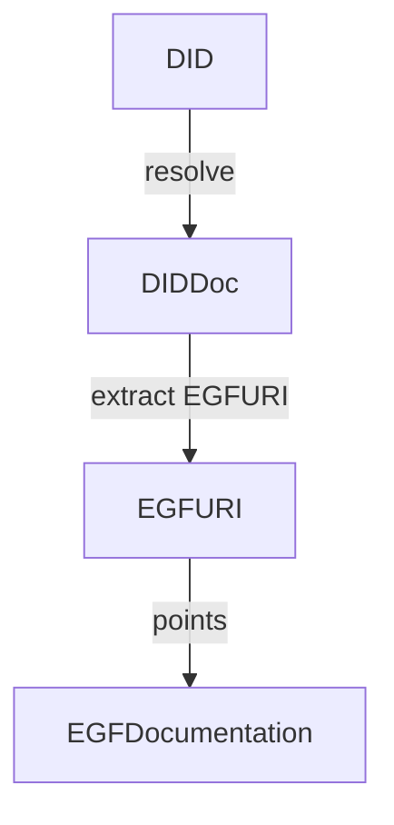
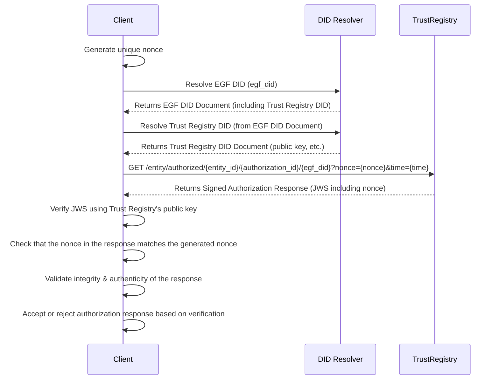
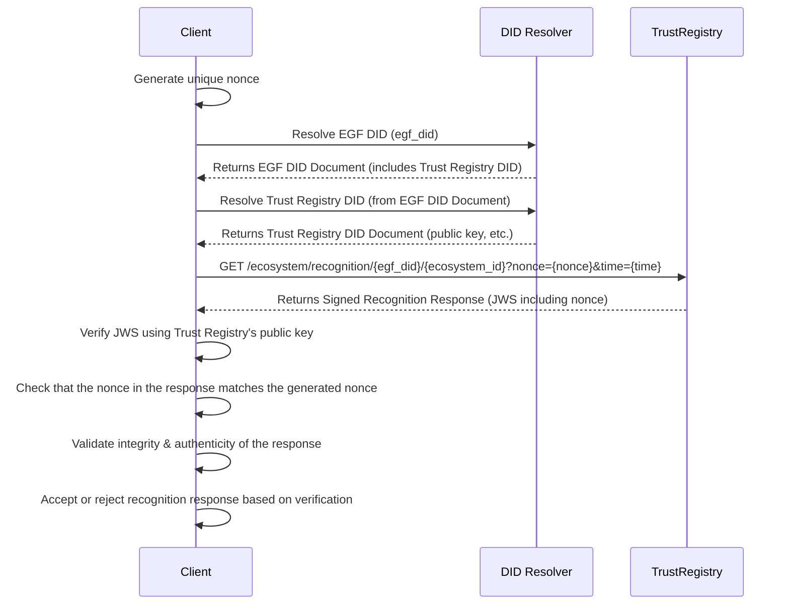

# RESTful/DID Based TRQP Profile

## Introduction 

This is a RESTful, DID based TRQP profile. It requires a small update to the DID Document of an EGF to support an egfURI. 

## **Identifiers**

This profile leverages DID identifiers for control objects ( such as EGF's and Entity Identifiers )
and URI's for all non-control objects ( such as authorizations ). 

All DID's are supported as long as are able to handle service endpoints and a egfURI field in the DIDDocument upon resolution. 

## **Trust Registry**

### **Identifiers**

* The Trust Registry **MUST** be identifiable using a Decentralized Identifier (DID), with the controlling entities specified in the `controller` field.  
* The Service Endpoint **MUST** reference the Trust Registry using the type `TRQPv1HTTPProfile`.  
* The Trust Registry **MUST** provide the controlling DID URL at the `/metadata` endpoint.

### **Metadata**
  
* **Encoding**:

  * The Trust Registry Metadata Data Model **MUST** be expressed in JSON format as per [RFC 8259](https://datatracker.ietf.org/doc/html/rfc8259).  
    * `id`: Represents the DID of the Trust Registry.  
    * `description`: Provides a description of the Trust Registry. All descriptions **MUST** be fewer than 4096 bytes to ensure network compliance.  
    * `name`: Denotes the human-readable name of the Trust Registry.  
    * `controllers`: An array of DID URLs representing the controller DIDs of the Trust Registry. This field **MUST** be present.  
* The metadata **MUST** be signed using a JSON Web Signature (JWS) as specified in [RFC 7515](https://www.rfc-editor.org/rfc/rfc7515.html).

#### **JSON Schema**

Below is the JSON Schema defining the structure of the Trust Registry metadata:

```
{
  "$schema": "http://json-schema.org/draft-07/schema#",
  "title": "Trust Registry Metadata",
  "type": "object",
  "properties": {
    "id": {
      "description": "Decentralized Identifier (DID) of the Trust Registry.",
      "type": "string",
      "pattern": "^did:[a-z0-9]+:[a-zA-Z0-9]+$"
    },
    "description": {
      "description": "Description of the Trust Registry.",
      "type": "string",
      "maxLength": 4096
    },
    "name": {
      "description": "Human-readable name of the Trust Registry.",
      "type": "string"
    },
    "controllers": {
      "description": "Array of DID URLs representing the controllers of the Trust Registry.",
      "type": "array",
      "items": {
        "type": "string",
        "format": "uri"
      },
      "minItems": 1
    }
  },
  "required": ["id", "description", "name", "controllers"],
  "additionalProperties": false
}
```

#### **Notes**

* **DID Pattern**: The `id` field uses a regex pattern to ensure it follows the standard DID format (`did:method:identifier`). Adjust the pattern as necessary to accommodate specific DID methods.
* **Controllers**: The `controllers` array requires at least one DID URL. Each entry must be a valid URI as per JSON Schema's `format: uri`.
* **Security**: Ensure that the JSON data adhering to this schema is properly signed using JWS to maintain integrity and authenticity.  
**Endpoints**
Trust Registry **MUST** support a GET `/metadata` endpoint. It **MUST** return the JWS Trust Registry Metadata Model described above. Verifiers _SHOULD_ verify the signature before proceding to trust the Trust Registry. 

## **Ecosystem Governance Framework**

All ecosystem governance frameworks are HTTP resolvable URIs managed by a DID Controller. 

All DID's with a service endpoint are allowed, but an additional `egfURI` **MUST** be registered 
in the DID Document to point to the ecosystem governance framework as well as an additioanl "validTrustRegistries". 

The `egfURI` **MUST** be a HTTP resolvable 
URI with information about the governance framework. There is no machine level governance model to 
resolve the ecosystem governance framework as a whole. 

The `validTrustRegistries` **MUST** be a array of DID's representing the trust registries representing the state of the ecosystem. 

The following example demonstrates how a DID Document `did:web:ebfexample` may be resolved to an egf. 
```
{
  "@context": [
    "https://www.w3.org/ns/did/v1",
    "https://w3id.org/security/suites/jws-2020/v1"
  ],
  "id": "did:web:example.com",
  "egfURI": "http://example.com/governance",
  "validTrustRegistries": ["did:asdf:asdf", did:asdf:asdf],
  "verificationMethod": [
    {
      "id": "did:web:example.com#key-0",
      "type": "JsonWebKey2020",
      "controller": "did:web:example.com",
      "publicKeyJwk": {
        "kty": "OKP",
        "crv": "Ed25519",
        "x": "0-e2i2_Ua1S5HbTYnVB0lj2Z2ytXu2-tYmDFf8f5NjU"
      }
    },
    {
      "id": "did:web:example.com#key-1",
      "type": "JsonWebKey2020",
      "controller": "did:web:example.com",
      "publicKeyJwk": {
        "kty": "OKP",
        "crv": "X25519",
        "x": "9GXjPGGvmRq9F6Ng5dQQ_s31mfhxrcNZxRGONrmH30k"
      }
    },
    {
      "id": "did:web:example.com#key-2",
      "type": "JsonWebKey2020",
      "controller": "did:web:example.com",
      "publicKeyJwk": {
        "kty": "EC",
        "crv": "P-256",
        "x": "38M1FDts7Oea7urmseiugGW7tWc3mLpJh6rKe7xINZ8",
        "y": "nDQW6XZ7b_u2Sy9slofYLlG03sOEoug3I0aAPQ0exs4"
      }
    },
  ],
  "authentication": [
    "did:web:example.com#key-0",
    "did:web:example.com#key-2"
  ],
  "assertionMethod": [
    "did:web:example.com#key-0",
    "did:web:example.com#key-2"
  ],
  "keyAgreement": [
    "did:web:example.com#key-1", 
    "did:web:example.com#key-2"
  ]
}
```



## **Authorization**


* **Identifier**: [HTTP](https://datatracker.ietf.org/doc/html/rfc2818) resolvable URI string following HTTP(s) URI pattern [RFC 3986](https://datatracker.ietf.org/doc/html/rfc3986). i.e 
   - http://example.com/authorizations/issue/drivers_license
   - http://196.1.1.3/authorizations/issue/drivers_license
* **Encoding**:
   * Authorization Data Model will be expressed in JSON encoding per [RFC 8259](https://datatracker.ietf.org/doc/html/rfc8259).
      * `id` will represent the identifier property. It MUST be a  HTTP resolvable URI. 
      * `description`: represents the Description property. All descriptions MUST be < 4096 bytes to be compliant with the network. 
      * `name`: represents the human readable name of the authorization. 
      * `controller` : represents the EGF DID of the controlling entity of the Authorization. See the EGFDID rules for how to describe and resolve the EGF profile. 
Here is a JSON schema to describe the encoding:
```json
{
  "$schema": "http://json-schema.org/draft-07/schema#",
  "title": "Authorization",
  "type": "object",
  "properties": {
    "id": {
      "type": "string",
      "format": "uri",
      "pattern": "^https?://.+",
      "description": "A HTTP resolvable URI serving as the unique identifier."
    },
    "description": {
      "type": "string",
      "maxLength": 4096,
      "description": "A description of the authorization. Must be less than 4096 bytes."
    },
    "name": {
      "type": "string",
      "description": "The human-readable name of the authorization."
    },
    "controller": {
      "type": "string",
      "format": "uri",
      "pattern": "^http://.+",
      "description": "The EGF URI of the controlling entity of the Authorization."
    }
  },
  "required": ["id", "description", "name", "controller"],
  "additionalProperties": false
}
```
- **HTTP Interface Lookups**
  * `GET /authorizations/{egfDID}/{id}` : returns a single JSON encoded Authorization Data Model. If `id` is not provided, returns a list of all authorizations. 
    * `{id}` represents the authorization identifier
    * `{egfDID}` represents the DID of the Ecosystem Governance Framework in Context. 

In the HTTP Lookup, it follows [HTTP response standard status codes](https://developer.mozilla.org/en-US/docs/Web/HTTP/Status).
A few particular and more common HTTP response codes are described in more detail below. 

  - 200 Status OK : In the case where the egfDID authorization is resolvable. 
  - 404 Not Found : To be returned when either the `authorization identifier` or the `egfDID` is not found within the Trust Registry. 
  - 401 Unauthorized : Status code only works intra-ecosystem. 
  
By default, all responses cross ecosystems should be considered public because 
there is no shared authorization mechanism within this profile. Therefore, any cross ecosystem request will not have an authorization contenxt to evaluate. 

- **Security Considerations**
   - This profiles does NOT enforce signing of the responses by the controlling EGF. This is to allow for easier adoption patterns, but a higher assurance profile MAY include a signing requirement against the JSON document to ensure that the authorization data has not been tampered with according to the EGF. 
   - This is HTTP based profile. Therefore, in identifiers not backed by HTTPS, TLS (SSL) advantages of HTTPS are not provided. 

## **Entity Status Request**

The **Entity Status Request** allows clients to verify the authorization status of an entity within the Trust Registry. All responses to these requests **MUST** be signed by the controller of the Trust Registry using a JSON Web Signature (JWS) to ensure authenticity and integrity.

Below, all times are represented as [ISO8601](https://www.iso.org/iso-8601-date-and-time-format.html).

### Protocol


### **Authorization Response**

The response to an Entity Status Request is a JSON object containing the authorization status of the entity. Below is the structure of the **Authorization Response**:

```
{
  "recognized": true,
  "authorized": true,
  "message": "",
  "evaluated_at": "2024-04-27T14:30:00Z",
  "response_time": "2024-04-27T14:30:05Z",
  "expiry_time": "2024-05-27T14:30:00Z"
}
```

#### **Response Fields**

* **recognized** (`boolean`): Indicates whether the entity ID is recognized by the Trust Registry.  
* **authorized** (`boolean`): Specifies whether the entity is authorized under the provided authorization ID.  
* **message** (`string`): Provides additional information or context regarding the authorization status.  
* **evaluated\_at** (`string`, `date-time`): The timestamp when the authorization status was evaluated.  
* **response\_time** (`string`, `date-time`): The timestamp when the response was generated.  
* **expiry\_time** (`string`, `date-time`): The timestamp when the authorization status expires.

### **HTTP Endpoints**

The Trust Registry **MUST** expose the following HTTP endpoint for Entity Status Requests:

```
GET /entity/authorized/{entity_id}/{authorization_id}/{egf_id}/{time}
```

#### **Endpoint Parameters**

* **entity\_id** (`string`): The unique identifier of the entity whose authorization status is being queried.  
* **authorization\_id** (`string`): The specific authorization identifier under which the entity is being evaluated.  
* **egf\_id** (`string`): The identifier for the governance framework or policy context.  
* **time** (`string`, `date-time`): The timestamp at which the authorization status is requested.

#### **HTTP Response Codes**

* **200 OK**: The entity is authorized under the specified `authorization_id`.

   **Response Body Example:**

```
{
  "recognized": true,
  "authorized": true,
  "message": "Entity is authorized under the specified authorization ID.",
  "evaluated_at": "2024-04-27T14:30:00Z",
  "response_time": "2024-04-27T14:30:05Z",
  "expiry_time": "2024-05-27T14:30:00Z"
}
```

*   
  **404 Not Found**: The entity is not found in the Trust Registry.

   **Response Body Example:**

```
{
  "recognized": false,
  "authorized": false,
  "message": "Entity not found.",
  "evaluated_at": "2024-04-27T14:35:00Z",
  "response_time": "2024-04-27T14:35:05Z",
  "expiry_time": null
}
```

*   
  **401 Unauthorized**: The request is forbidden or lacks valid authentication credentials.

   **Response Body Example:**

```
{
  "recognized": false,
  "authorized": false,
  "message": "Forbidden request. Invalid or missing credentials.",
  "evaluated_at": "2024-04-27T14:40:00Z",
  "response_time": "2024-04-27T14:40:05Z",
  "expiry_time": null
}
```

### **JSON Schema**

Below is the JSON Schema defining the structure of the **Authorization Response**:

```
{
  "$schema": "http://json-schema.org/draft-07/schema#",
  "title": "Authorization Response",
  "type": "object",
  "properties": {
    "recognized": {
      "description": "Indicates whether the entity ID is recognized by the Trust Registry.",
      "type": "boolean"
    },
    "authorized": {
      "description": "Specifies whether the entity is authorized under the provided authorization ID.",
      "type": "boolean"
    },
    "message": {
      "description": "Additional information regarding the authorization status.",
      "type": "string"
    },
    "evaluated_at": {
      "description": "Timestamp when the authorization status was evaluated.",
      "type": "string",
      "format": "date-time"
    },
    "response_time": {
      "description": "Timestamp when the response was generated.",
      "type": "string",
      "format": "date-time"
    },
    "expiry_time": {
      "description": "Timestamp when the authorization status expires.",
      "type": ["string", "null"],
      "format": "date-time"
    }
  },
  "required": ["recognized", "authorized", "message", "evaluated_at", "response_time"],
  "additionalProperties": false
}
```

## Ecosystem Recognition

Ecosystem recognition verifies that a DID-based Ecosystem Governance Framework (EGF) is recognized within the Trust Registry. In this context, “recognition” indicates whether the Trust Registry acknowledges a specific EGF DID under a given policy or framework, optionally at a particular point in time.

### Protocol

### HTTP Endpoint

The Trust Registry **MUST** expose the following endpoint to check whether an ecosystem (identified by its DID) is recognized:

* GET /ecosystem/recognition/{egf_id}/{ecosystem_id}?context={}&time={}

#### Endpoint Parameters

- **egf_id** (`string`):  
  The identifier for the overarching governance framework or policy context used by the Trust Registry.

- **ecosystem_id** (`string`):  
  The DID of the ecosystem governance framework whose recognition status is being queried.

- **context** (`string`, optional query parameter):  
  An optional parameter for additional context or namespace (e.g., sub-ecosystem or specific policy domain). Its usage depends on the ecosystem’s requirements.

- **time** (`string`, `date-time`, optional query parameter):  
  A timestamp in [RFC 3339](https://datatracker.ietf.org/doc/html/rfc3339) format specifying the point in time at which recognition is requested. If omitted, the Trust Registry **SHOULD** assume the current time.

### HTTP Response Codes

Below are the most common response outcomes:


* **200 OK**: The ecosystem is not recognized by the Trust Registry.

   **Response Body Example:**

```
{
  "recognized": false,
  "message": "Ecosystem not found in the Trust Registry.",
  "evaluated_at": "2024-04-27T14:35:00Z",
  "response_time": "2024-04-27T14:35:05Z",
  "expiry_time": null
}
```

*  **404 Not Found**: The ecosystem is not recognized by the Trust Registry.

   **Response Body Example:**

```
{
  "recognized": false,
  "message": "Ecosystem not found in the Trust Registry.",
  "evaluated_at": "2024-04-27T14:35:00Z",
  "response_time": "2024-04-27T14:35:05Z",
  "expiry_time": null
}
```

*   **401 Unauthorized**: The request is not permitted or lacks valid authentication credentials (applicable in intra-ecosystem contexts).
   **Response Body Example:**

```
{
  "recognized": false,
  "message": "Forbidden request. Invalid or missing credentials.",
  "evaluated_at": "2024-04-27T14:40:00Z",
  "response_time": "2024-04-27T14:40:05Z",
  "expiry_time": null
}
```

### JSON Schema: Recognition Response
 
 Below is the JSON Schema defining the structure of the Recognition Response:
 
 ```
 {
  "$schema": "http://json-schema.org/draft-07/schema#",
  "title": "Recognition Response",
  "type": "object",
  "properties": {
    "recognized": {
      "description": "Indicates whether the ecosystem ID is recognized by the Trust Registry.",
      "type": "boolean"
    },
    "message": {
      "description": "Additional information regarding the recognition status.",
      "type": "string"
    },
    "evaluated_at": {
      "description": "Timestamp when the recognition status was evaluated.",
      "type": "string",
      "format": "date-time"
    },
    "response_time": {
      "description": "Timestamp when the response was generated.",
      "type": "string",
      "format": "date-time"
    },
    "expiry_time": {
      "description": "Timestamp when recognition status expires (if applicable).",
      "type": ["string", "null"],
      "format": "date-time"
    }
  },
  "required": ["recognized", "message", "evaluated_at", "response_time"],
  "additionalProperties": false
}
 ```
 
 
#### Notes: 

* **Signing:** As with all responses in this profile, the Recognition Response MUST be signed using JSON Web Signatures (JWS) to ensure authenticity and integrity.
* **Security:** Ensure that private keys used to sign the response are securely managed.
* **Time Parameters:** Timestamps MUST conform to RFC 3339.
* **Error Handling:** Keep error messages concise and avoid exposing sensitive information.
Copy code

## **Notes**
* **DID Pattern**: The `id` field uses a regex pattern to ensure it follows the standard DID format (`did:method:identifier`). Adjust the pattern as necessary to accommodate specific DID methods.
* **Controllers**: The `controllers` array requires at least one DID URL. Each entry must be a valid URI as per JSON Schema's `format: uri`.

* **Security**:
  * All JSON objects, including metadata and authorization responses, **MUST** be signed using JSON Web Signatures (JWS) to ensure data integrity and authenticity.  
  * Ensure that the Trust Registry's private keys are securely managed to prevent unauthorized signing of responses.  
* **HTTP Endpoints**:
  * The `/authorized/{entity_id}/{authorization_id}/{egf_id}/{time}` endpoint **MUST** validate all path parameters to prevent injection attacks and ensure proper formatting.  
  * Implement appropriate rate limiting and authentication mechanisms to protect the endpoint from abuse.  
* **Timestamp Formats**:
  * All timestamp fields (`evaluated_at`, `response_time`, `expiry_time`) **MUST** adhere to the [RFC 3339](https://datatracker.ietf.org/doc/html/rfc3339) date-time format to ensure consistency and interoperability.  
* **Error Handling**:
  * Provide clear and descriptive messages in the `message` field to aid in debugging and user understanding.  
  * Avoid exposing sensitive information in error messages to maintain security best practices.

## Other Considerations

This profile does not dicatate how one receives the Authorization ID, Ecosystem Governance Framework, and Subject to inquire about. That is left to the Ecosystem to determine. 

