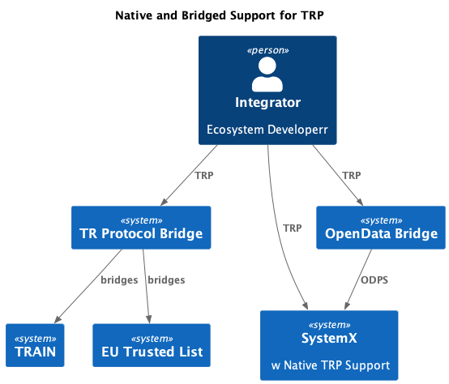

[//]: # (Pandoc Formatting Macros)

[//]: # (\mainmatter)

[//]: # (\doctitle)

## Scope

The Trust Registry Protocol serves to provide a simple interface to the plethora of systems that contain answers that are required to make trust decisions. 

The TRP does not:  
  * create a trust registry - it allows (read-only) access to a system-of-record that has the data needed to generate answers that a trust registry provides.
  * create new information - the Create, Update, and Delete of CRUD are not supported. Systems-of-record perform the full CRUD operations. The protocol provides a simple and consistent way of retrieving information from a system.
  * implement governance - the system-of-record that supports the TRP may have technical ways of doing this, supported by manual operations. Regardless, the TRP has no opinion on how governance is implemented - just that the information retrieved complies with the stated EGF.
  * make decisions - the TRP serves up data that are inputs to trust decisions.
  * assign Roles or Rights, though a consuming system may take information that is received via the TRP and assign these.

### Purpose

The purpose of this **ToIP specification** is to define a standard interoperable protocol for interacting with a global web of **peer trust registries**, each of which can answer queries about whether a particular **party** is trusted and authorized, to perform a particular **action** in a particular **digital trust ecosystem** (defined under an **EGF**), as well as which **peer trust registries** trust each other.

### Motivations

A core role within **Layer 4** of the **ToIP stack** is a **trust registry** (previously known as a **member directory**). This is a network service that enables the **governing authority** for an **ecosystem governance framework (EGF)** to specify what **governed parties** are authorized to perform what **actions** under the EGF. For example:

1. Which **entities** are **authorized** to take what **actions** under an EGF. 
    - e.g.  is an entity authorized to "issue" a "driver license"; is an entity authorized to "sign" data. 
2. What other **trust registries** are **recognized** by this particular **trust registry**.

As with all layers of the **ToIP stack**, the purpose of a **ToIP specification** is to enable the technical interoperability necessary to support **transitive trust** within and between different **trust communities** implementing the **ToIP stack**. In this case, the desired interoperability outcome is a common protocol that works between any number of decentralized **peer trust registries** operated by independent **governing authorities** representing multiple legal and business **jurisdictions**. One specific example of this need is the **digital trust ecosystem** defined by the [Interoperability Working Group for Good Health Pass](https://wiki.trustoverip.org/pages/viewpage.action?pageId=73790) (GHP). 

A Registry of Registries (RoR), is a form of **trust registry** that primarily serves information about other **trust registries**. 

1. What other **governing authorities** are known to the RoR. 
2. Which **trust registry** are known to be authoritative for particular actions. Examples:
	- Which trust registry is known to issue university diplomas for a particular jurisdiction?
  - Which trust registry is known to manage a list of professionals (e.g. CPAs, lawyers, engineers) that have particular signing rights (authorizations)?
3. Which **trust registry** are known to operate under a given **EGF**.

### Use of the Trust Registry Protocol.

The TRP is intended to be used in at least two key ways:

* Native Support - systems may directly implement access using the TRP.
* Bridged - systems may create access "bridges" that provide TRP access to their systems.

.

### Object Model

We provide a high-level object model (NOTE: source of truth is the Swagger as this diagram may be out of date during development)

