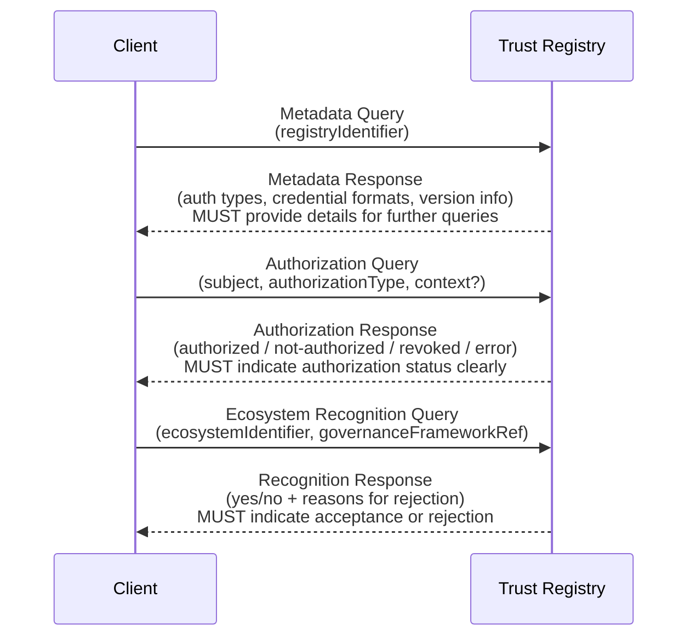

## Metadata Models

### Trust Registry
_This section is normative._

* **Properties**
  * **id: MUST** be a globally unique identifier for the registry (e.g., URI, DID, UUID)
  * **ecosystem: SHOULD** indicate which ecosystem(s) the registry serves or recognizes
  * **controller: SHOULD** reference the entity that manages or operates the registry

### Ecosystem
_This section is normative_

* **Properties**
  * **id: MUST** be a globally unique identifier for the registry (e.g., URI, DID, UUID)
    * **egf_id: MUST** specify a *resolvable* EGF identifier `referencing the official EGF document
  * **trustregistries: MUST** provide a list of authorized Trust Registries that serve the ecosystem authority state [[ref:Authority State]]
    * Each registry **MUST** have the following properties:
      * **endpoint**: The address (URL, DID, etc.) for TRQP queries [[ref:Authority Query]] / [[ref:Recognition Query]]
    * Each registry **MAY** also be scoped to a particular set of authorization states as defined in the Binding [[ref:TRQP Binding]]
  * **controller: SHOULD** include a method of validating ecosystem controllers

## Baseline Requirements For Conformance

### Trust Registry
_This section is normative_

* All TRQP registries **MUST** provide an addressable endpoint resolvable as defined by the Implementation Profile
* All Trust Registries **MUST** supply the required interfaces described in the Required Interfaces section over the *same* addressable endpoint to be TRQP conformant

### TRQP Binding
_This section is normative_

* All compliant [[ref:TRQP Binding]]s **MUST** support the required interfaces described in the Required Interfaces section
* A compliant [[ref:TRQP Binding]] **MUST** comply with [[ref:TRQP Core]] requirements
* A compliant [[ref:TRQP Binding]] **MUST** support versioning using [Semantic Versioning 2.0](https://semver.org/)

### TRQP Profiles
_This section is normative_

* All TRQP profiles **MUST** specify a compliant [[ref:TRQP Binding]]

### Error Response Considerations

_this section is normative_

#### Query Error Handling Guidelines
_this section is informative_

This document outlines general guidelines for handling errors in responses to queries within the Trust Registry Query Protocol. The approach described here is abstracted from any specific transport or protocol (such as HTTP) to offer guidance applicable across various implementations.

#### General Data Model for Errors

Error responses should provide the following structured information which MUST be described in the binding.

- `statuscode` *(number)*: A numeric code identifying the type of error.  
- `message` *(string)*: A clear and descriptive explanation for developers and implementers.  
- `details` *(optional, object)*: Additional context that aids in diagnosing or rectifying the issue.

The following section describes the suggested code number and the situations when you should use the response.

### Error Codes
_This section is normative_

Consider a range of status codes:

* `0-99`: Success Codes - operation has been completed successfully
* `100-199`: General Errors - General system errors. 
* `200-299`: Resource Errors - Errors that relate to resources.
* `300-399`: Authentication Errors - errors that relate to authentication of querier.
* `400-499`: Validation Errors - errors related to the validation of query inputs.

This range has been established to provide more detail in future versions without breaking existing status codes.

The following `statuscode` values apply to all queries:

| Return Code | Return Message         | Description                   | 
| ----------- | --------------         | -----------                   |
| `statuscode`| `message`              | `details`                     |
| 0           | success                | Query Completed Successfully  |
| 100         | error                  | error (see detail)            |
| 200         | notfound               | not found                     |
| 201         | notfound:ecosystem_id  | EcosystemID not found (see `TODO` below)        |
| 300         | unauthorized           | Authorization error           |
| 400         | invalidrequest         | Invalid request               |

`TODO ------------------------------------`

* `SUGGESTION:` REMOVE 201 (here and below) and use 200

#### Recommendations for Implementers
_this section is non-normative_

- Error responses should be consistent and predictable.  
- Clearly differentiate between recoverable errors (such as malformed requests) and terminal conditions (such as missing resources).  
- Include contextual information whenever possible to expedite issue resolution.

## Required Interfaces
_This section is normative_

Below are abstract API methods that **MUST** be exposed. Each **[[ref:TRQP Binding]]** **MUST** define a binding (e.g., REST, gRPC, DIDComm) that maps these methods to actual endpoints.

**Figure 5:** Sequence diagram showing interactions between a client and Trust Registry for the required interfaces.

### Metadata Query
_This section is normative_

#### Metadata Query Models

* **Request**:  
  There are no mandatory request parameters.  
  * Optionally, an `ecosystem_id` can specify that the metadata request should be interpreted within a specific ecosystem's governance framework context [[ref:Ecosystem Governance Framework]]

* **Response**:  
  * `id`: string. Uniquely identifies the registry. If an `ecosystem_id` is provided, the response must clearly reflect that the returned data is scoped to the specified ecosystem (e.g., "ecosystem A").

#### Metadata Query Errors
_This section is normative_

- **Ecosystem Identifier Not Found** 
  - **When:** The provided registry identifier does not exist. 
  - **Description:** Indicates the registry identifier specified in the query was not found.
  - **statuscode:** 201 
- **Malformed Request**
  - **When:** Request parameters are missing or incorrectly formatted.
  - **Description:** Indicates the request lacks required parameters or contains invalid data.
  - **statuscode:** 400

### Authorization Query
_This section is normative_

#### Authorization Model

* **Request**:
  * **ecosystem_id**: string. An ecosystem identifier as defined in the TRQP Binding.  
    - *Example*: `"ecosystem_id": "ecosystem A"`
  * **authorization_id**: string. Must match one of the defined authorization types in the TRQP Binding.  
    - *Example*: `"authorization_id": "credential-A-issuer"`
  * **entity_id**: string. Identifies the entity for which the authorization is being queried.  
    - *Example*: `"entity_id": "random-id-1234"`
  * **time**: string (optional). Specifies when the Trust Registry should evaluate the authority query.
    * If supplied, must adhere to the required time format (e.g., RFC3339 UTC)
    * If omitted, the system must use the current time and include that timestamp in its response

* **Response**:  
  A status indicating the entity's authorization:
  - **authorized**
  - **not-authorized**
  - **revoked**
  - **unknown-subject**
  - **error**  
  
  Optionally, the response may include additional details on validity or supporting proof references.

* **Behavior**:  
  The system **MUST** clearly indicate whether the subject holds the specified authorization.

#### Authorization Query Errors
_This section is normative_

- **Ecosystem ID Not Found** 
  - **When:** The specified ecosystem ID is not recognized by the registry.
  - **Description:** Indicates the ecosystem identifier does not exist in the registry.
  - **statuscode:** 201
- **Invalid Authorization Type** 
  - **When:** Authorization type provided does not match known types.  
  - **Description:** Indicates the authorization type specified is invalid or unrecognized.  
  - **statuscode:** 200
- **Authorization Type Not Found** 
  - **When:** Authorization type provided does not match known types.  
  - **Description:** Indicates the authorization type specified is not available. 
  - **statuscode:** 200 
- **Unknown Entity ID** 
  - **When:** The provided entity ID does not exist in registry records.  
  - **Description:** Indicates the entity ID provided in the query is unknown.  
  - **statuscode:** 200
- **Invalid Time Requested** 
  - **When:** The time parameter provided is invalid or incorrectly formatted.  
  - **Description:** Indicates the requested time parameter does not conform to expected formats.  
  - **statuscode:** 400

### Ecosystem Recognition Query
_This section is normative_

#### Ecosystem Recognition Models

* **Request**:
  * **ecosystem_id**: string. The identifier for the ecosystem, defined in the TRQP Binding.  
    - *Example*: `"ecosystem_id": "ecosystem A"`
  * **target_ecosystem_id**: string (optional). Another ecosystem identifier against which recognition is being evaluated.
  * **scope**: string (optional). Can filter or narrow the request. The specification doesn't enforce a specific structure for scopes, but individual profiles may define their own conventions.
  * **time**: string (optional). May be provided as described in the TRQP Binding guidelines.

* **Response**:  
  The recognition status of the ecosystem:
  - **accepted** (if recognized)
  - **rejected** (if not)  
  
  Additional supporting details, such as proof references or log entries, may be included.

* **Behavior**:  
  The system **MUST** return a clear yes/no answer regarding ecosystem recognition, and **MAY** provide further explanation as specified in the TRQP Binding.

#### Ecosystem Recognition Query Errors

- **Ecosystem ID Not Found** 
  - **When:** The ecosystem ID of the requesting ecosystem is not recognized. 
  - **Description:** Indicates that the source ecosystem specified is not registered or recognized. 
  - **statuscode:** 201 
- **Target Ecosystem ID Not Found** 
  - **When:** The ecosystem ID of the target ecosystem is unknown or unrecognized. 
  - **Description:** Indicates the target ecosystem specified in the query does not exist. 
  - **statuscode:** 200 
- **Scope Not Found** 
  - **When:** The ecosystem ID of the target ecosystem is not found. 
  - **Description:** Indicates the target ecosystem specified in the query does not exist. 
  - **statuscode:** 200 
- **Malformed Recognition Request** 
  - **When:** Request parameters are incomplete or incorrectly formatted.  
  - **Description:** Indicates essential elements of the recognition request are missing or invalid.  
  - **statuscode:** 400

