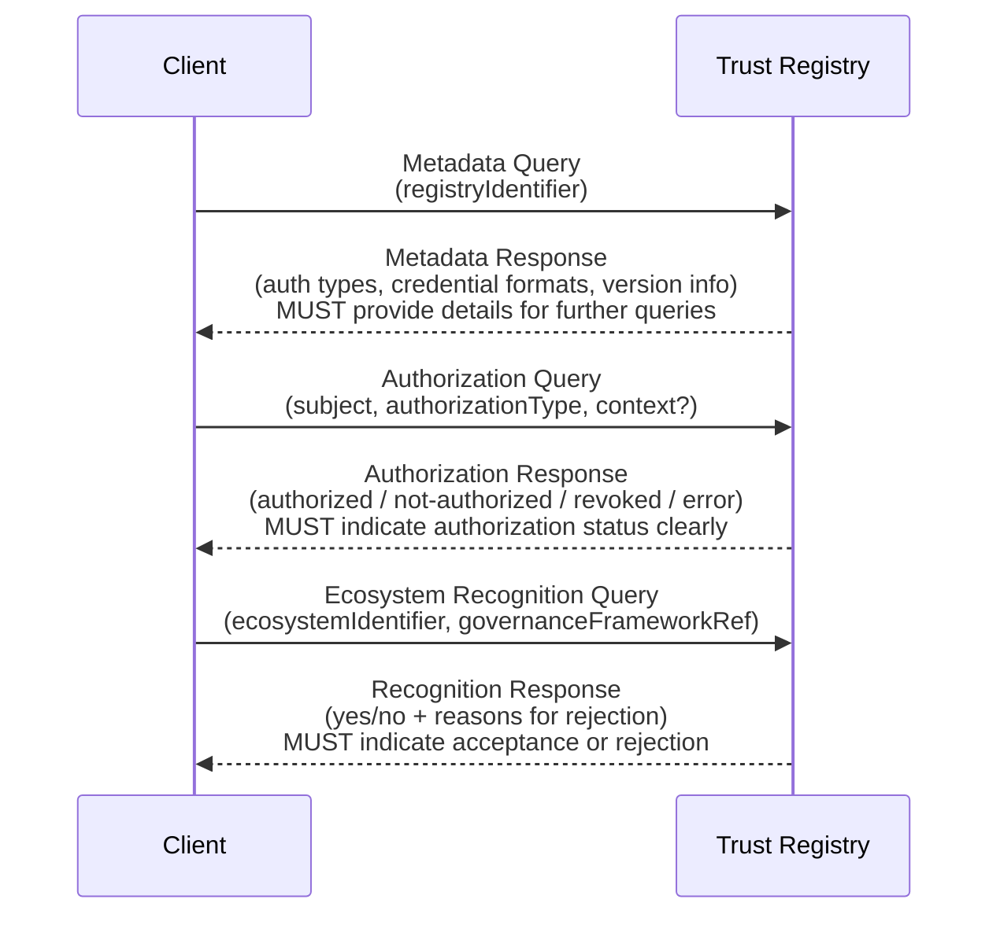

## Introduction
_This section is non-normative_

Modern digital ecosystems [[ref:Digital Trust Ecosystem]] rely on diverse **[[ref:Intra-Ecosystem Trust Framework]]s** (e.g., OpenID
Federation, X.509 Chains, EBSI Trust Chains, TRAIN). While these frameworks effectively verify authorizations **within** their respective ecosystems, they struggle with cross-ecosystem verification. When verifiers need to validate authorizations **across** different ecosystems, they face interoperability challenges due to incompatible data models, inconsistent APIs, and varying governance rules.

The **Trust Registry Query Protocol (TRQP)** bridges this gap by providing a standardized way to query and verify authorizations and recognitions across ecosystems. It does not replace existing intra-ecosystem solutions [[ref:Intra-Ecosystem Trust Framework]]; rather, it acts as a **bridge** between them—a so-called "inter-trust framework" [[ref:Inter-Ecosystem Trust Framework]]. 

In practical terms, TRQP allows a verifier to answer questions such as:

- "Does **Entity X** have **Authorization Y** under **Ecosystem Z's** governance framework [[ref:Ecosystem Governance Framework]]?"
- "Is **Entity X** **Recognized** under **Ecosystem Y's** governance framework [[ref:Ecosystem Governance Framework]] for **Z**?"

This specification describes the abstract rules, data models, and query flows necessary to implement TRQP. It intentionally leaves concrete details—such as transport protocols, message formats, and discovery mechanisms—to ecosystem-specific or domain-specific [[ref:TRQP Binding]]s. By adhering to this specification, implementers ensure a consistent, secure, and interoperable means of authorization verification **across** multiple trust frameworks.

## Terms and Definitions
_This section is non-normative_

 [[def:Authority Query, Authority Queries]]
~ A request that seeks to verify whether a specific entity (subject) holds a particular authorization, credential, or right within an ecosystem.

 [[def:Authority State, Authority States]]
~ A recorded status indicating whether an entity currently possesses a valid authorization within an ecosystem. It reflects the definitive condition of the entity's rights or credentials at a given point in time.

 [[def:Authority Statement, Authority Statements]]
~ An assertion by an **authority** about either: a) the **authorization** or **delegation** it grants to another party over which it has authority, or b) the **recognition** it gives to a peer about the scope of that peer's authority.

 [[def:Digital Trust Ecosystem, Digital Trust Ecosystems]]
~ A [digital ecosystem](https://glossary.trustoverip.org/#term:digital-ecosystem) in which participants are one or more interoperating [trust communities](https://glossary.trustoverip.org/#term:trust-communities). Governance of various [roles](https://glossary.trustoverip.org/#term:roles) within this ecosystem is typically managed by a [governing body](https://glossary.trustoverip.org/#term:governing-body) using a [governance framework](https://glossary.trustoverip.org/#term:governance-framework). Many digital trust ecosystems maintain one or more [trust registries](https://glossary.trustoverip.org/#term:trust-registries).

 [[def:Ecosystem Governance Framework, Ecosystem Governance Frameworks]]
~ A [governance framework](https://glossary.trustoverip.org/#term:governance-framework) for a [digital trust ecosystem](https://glossary.trustoverip.org/#term:digital-trust-ecosystem). This may incorporate other types of frameworks such as [credential governance frameworks](https://glossary.trustoverip.org/#term:credential-governance-framework).

 [[def:Inter-Ecosystem Trust, Inter-Ecosystem Trusts]]
~ The confidence and assurance established between two or more distinct ecosystems or governance frameworks. This enables cross-recognition of rules, trust registries, and authorization states.

 [[def:Intra-Ecosystem Trust Framework, Intra-Ecosystem Trust Frameworks]]
~ The confidence and assurance maintained within a single ecosystem or governance framework. It applies to entities operating under the same set of rules and oversight mechanisms.

 [[def:Hierarchical Authority Relationship, Hierarchical Authority Relationships]]
~ A unilateral and exclusive relationship between an authority and another party subject to that authority. The authority is the only one who can grant or revoke authorization from the authorized party.

 [[def:Recognition Relationship, Recognition Relationships]]
~ A heterarchical authority relationship between two peer authorities, each authoritative for their own ecosystems. This relationship can be unilateral or bilateral and is non-exclusive. One authority attests to the other's authority in one or both directions.

 [[def:Recognition Query, Recognition Queries]]
~ A request that enables a verifier to check the Recognition Relationship [[ref:Recognition Relationship]] of an ecosystem in relation to another ecosystem.

 [[def:TRQP Core]]
~ The foundational specification that defines core data models, queries, and security requirements necessary for consistent, interoperable trust interactions across different systems and ecosystems.

 [[def:TRQP Binding, TRQP Bindings]]
~ A technical specification document that outlines the precise requirements for implementing interoperability via the base TRQP interfaces and data models. It dictates how systems should interact and exchange trust information.

 [[def:TRQP Bridge, TRQP Bridges]]
~ A software or infrastructure component that connects a [[ref:System of Record]] to a specified [[ref:TRQP Binding]], enabling seamless data exchange and interoperability.

 [[def:System of Record, Systems of Record]]
~ An authoritative source that manages and maintains authority and recognition statuses for participants within an ecosystem. It preserves the integrity and continuity of records.

## Scope
_This section is non-normative_

This specification focuses primarily on defining the **[[ref:TRQP Core]]** framework. While **[[ref:TRQP Binding]]s** and **[[ref:TRQP Bridge]]s** are essential for interoperability, their specific implementations are left to ecosystem implementers. 

**[[ref:TRQP Binding]]s** extend the core abstractions to concrete implementations, while **[[ref:TRQP Bridge]]s** connect ecosystems to their **[[ref:System of Record]]s**. This specification does not prescribe how they should be designed or deployed, allowing flexibility for diverse ecosystem needs.

**Figure 1:** This specification addresses the core requirements for a binding specification to be TRQP compliant. Ecosystems must build their own bindings.

## Problem Statement
_This section is non-normative_

Modern digital ecosystems rely on **[[ref:Intra-Ecosystem Trust Framework]]s** to manage authorization within their own boundaries. While effective within a single ecosystem, these frameworks don't easily extend to others. Organizations face significant challenges when verifying authorizations across different frameworks, including:

* **Siloed Trust Frameworks**: Each ecosystem typically operates in isolation without standardized methods for cross-ecosystem authorization verification
* **Inconsistent Interfaces**: Diverse APIs, credential formats, and governance rules force implementers to work with multiple disparate interfaces

When attempting to establish **[[ref:Inter-Ecosystem Trust Framework]]s**, verifiers face two fundamental questions:

1. **Ecosystem Recognition**:

   *"Do I recognize the governance framework [[ref:Ecosystem Governance Framework]] of the other ecosystem?"*

   This question is inherently complex and depends on human policy decisions, making it difficult to automate.

2. **Entity Authorization**:

   *"Is the issuer authorized to issue this type of data under the ecosystem's governance framework [[ref:Ecosystem Governance Framework]]?"*

   This question takes the form of an **[[ref:Authority Query]]**, a formal request to confirm whether an entity holds a specific authorization within the ecosystem.

**Figure 2:** The two fundamental queries required for cross-ecosystem authority verification.

TRQP addresses the [[ref:Inter-Ecosystem Trust Framework]] problem by enabling verifiers outside an ecosystem to submit **[[ref:Authority Query]]** and **[[ref:Recognition Query]]** requests to any TRQP-compliant network. The specification works independently of any particular [[ref:System of Record]] or intra-trust framework, ensuring trust can be established across different ecosystems without requiring changes to existing authority systems.

## High-Level Architecture
_This section is non-normative_

The **TRQP** architecture enables standardized cross-ecosystem queries for trust registry information, authorization, and recognition. At its core, TRQP comprises:

1. An **abstract specification** (the *Core*) defining data models, query flows, and security considerations (**[[ref:TRQP Core]]**)
2. One or more **concrete bindings** (**[[ref:TRQP Binding]]s**) that map the abstract specification to specific transport protocols (e.g., HTTPS, DIDComm, TSP)
3. **[[ref:TRQP Bridge]]s** that connect TRQP queries to particular trust frameworks (OIDF Federation, X.509, etc.)
4. **[[ref:System of Record]]s**—the actual trust frameworks or registries responsible for issuing or validating trust information

This layered approach allows implementers to select or build only what they need. If a trust framework hasn't implemented TRQP, integrators can connect a new **[[ref:TRQP Bridge]]** to a **[[ref:TRQP Binding]]** for it, provided they follow the core specification and a compatible binding. This specification focuses on the abstract core layer and does not detail lower layers in the stack.

**Figure 3:** TRQP Architecture has three layers: Core, Bindings, and Bridges. Profiles can be built on top to enable networks.

Details of *[[ref:TRQP Bridge]]s*, *[[ref:System of Record]]s*, and *[[ref:TRQP Binding]]s* are out of scope for this specification but defined conceptually for other specifications to describe in detail.

The following sections briefly explain each layer, with deeper focus on the **[[ref:TRQP Core]]** layer.

### TRQP Core
_This section is non-normative_

* **What it is**: The [[ref:TRQP Core]] is an **abstract** specification that defines:
  * **Data Models**: Metadata, authorization, ecosystem recognition, etc.
  * **Required Queries**: MetadataQuery, AuthorizationQuery, and EcosystemRecognitionQuery.
* **Role**: It ensures every TRQP-based implementation speaks the same "language" (even if actual messages travel over different transports).

### TRQP Bindings
_This section is non-normative_

* **What they are**: Concrete mappings of the Core specification onto specific transports and protocols. For example:
  * **HTTPS Binding**: Implements TRQP queries over HTTPS.
* **Role**: A [[ref:TRQP Binding]] transforms abstract queries from the Core spec into real network requests and responses in a standardized way.

### TRQP Bridges
_This section is non-normative_

* **What they are**: Adapters that connect a chosen [[ref:TRQP Binding]] to a specific trust framework (X.509, OIDF, DIF CTE, etc.).
* **Examples**:
  * **X.509 Bridge**: Translates TRQP queries into X.509 certificate validations and chain checks.
  * **OIDF Bridge**: Leverages OpenID Federation endpoints to answer TRQP queries about OIDC-based trust relationships.
  * **CTE Bridge**: Adapts TRQP queries to DIF's Credential Trust Establishment protocols.
* **Role**: A [[ref:TRQP Bridge]] "bridges" existing frameworks into TRQP by implementing the relevant [[ref:TRQP Binding]] and mapping framework-specific data.

### Systems of Record
_This section is non-normative_

* **Definition**: Real-world trust frameworks or registries storing authoritative data, including:
  * **OIDF Federation** (various profiles)
  * **X.509 Ecosystem** (with a CA and certificate hierarchy)
  * **TRAIN** (trust registry or network)
  * **EU Trusted List** (an EU-level trust list or EBSI-based registry)
* **Role**: The ultimate source of truth for whether an entity is recognized, authorized, or otherwise valid within a particular ecosystem (**[[ref:System of Record]]**).

### TRQP Profiles
_This section is non-normative_

* **Definition**: TRQP Profiles specify implementation details for aligning a trust network with TRQP standards.
* **Examples**:
  * **Identifier Design**: How entities are uniquely identified within the system.
  * **Resolution Paths**: The process for resolving trust queries within a given framework.
* **Role**: Profiles guide adaptation of TRQP to different ecosystems, ensuring queries, identifiers, and resolution mechanisms conform to standardized practices.

## Ecosystem and Trust Registry Relationship
_This section is non-normative_

**Figure 4:** A trust registry may serve multiple ecosystems, and an ecosystem may have multiple trust registries.

Each Ecosystem (yellow box in the diagram) consists of:

* An identifier (green box) – A globally unique reference
* An EGF Document (green box) – The Ecosystem Governance Framework [[ref:Ecosystem Governance Framework]], which defines governance terms, policies, and operational rules

The dashed arrows from Ecosystems point to Trust Registries below, indicating:

* Each Ecosystem explicitly references Trust Registries it recognizes for managing authority-related queries [[ref:Authority Query]]
* Trust Registries enforce the rules outlined in the EGF document

Each Trust Registry (green box in the lower row) consists of:

* An identifier (yellow box) – A unique reference
* References to one or more Ecosystems it serves (if supported by the metadata)

### Role of the Trust Registry in Ecosystem Governance
_This section is non-normative_

A Trust Registry manages authority statements [[ref:Authority Statement]] across one or more Ecosystems by:

* Maintaining structured records of trust relationships and authorization statuses
* Handling authority queries [[ref:Authority Query]] (as described in the Required Interfaces section)
* Operating under ecosystem governance, with the governing body defining policies for registration

### Scalability and Multi-Ecosystem Trust Registries
_This section is non-normative_

* A single Trust Registry may serve multiple Ecosystems as shared infrastructure
* An Ecosystem may rely on multiple Trust Registries for redundancy or diverse verification approaches
* The Trust Registry operates within the authority scope defined by each ecosystem's EGF Document

## Metadata Models

### Trust Registry
_This section is normative_

* **Properties**
  * **id: MUST** be a globally unique identifier for the registry (e.g., URI, DID, UUID)
  * **ecosystem: SHOULD** indicate which ecosystem(s) the registry serves or recognizes
  * **controller: SHOULD** reference the entity that manages or operates the registry

### Ecosystem
_This section is normative_

* **Properties**
  * **id: MUST** be a globally unique identifier for the registry (e.g., URI, DID, UUID)
  * **egf_id: MUST** specify a *resolvable* EGF identifier referencing the official EGF document
  * **trustregistries: MUST** provide a list of authorized Trust Registries that serve the ecosystem authority state [[ref:Authority State]]
    * Each registry **MUST** have the following properties:
      * **endpoint**: The address (URL, DID, etc.) for TRQP queries [[ref:Authority Query]] / [[ref:Recognition Query]]
    * Each registry **MAY** also be scoped to a particular set of authorization states as defined in the Binding [[ref:TRQP Binding]]
  * **controller: SHOULD** include a method of validating ecosystem controllers

## Baseline Requirements For Conformance

### Trust Registry
_This section is normative_

* All TRQP registries **MUST** provide an addressable endpoint resolvable as defined by the Implementation Profile
* All Trust Registries **MUST** supply the required interfaces described in the Required Interfaces section over the *same* addressable endpoint to be TRQP conformant

### TRQP Binding
_This section is normative_

* All compliant [[ref:TRQP Binding]]s **MUST** support the required interfaces described in the Required Interfaces section
* A compliant [[ref:TRQP Binding]] **MUST** comply with [[ref:TRQP Core]] requirements
* A compliant [[ref:TRQP Binding]] **MUST** support versioning using [Semantic Versioning 2.0](https://semver.org/)

### TRQP Profiles
_This section is normative_

* All TRQP profiles **MUST** specify a compliant [[ref:TRQP Binding]]

## Required Interfaces
_This section is normative_

Below are abstract API methods that **MUST** be exposed. Each **[[ref:TRQP Binding]]** **MUST** define a binding (e.g., REST, gRPC, DIDComm) that maps these methods to actual endpoints.

**Figure 5:** Sequence diagram showing interactions between a client and Trust Registry for the required interfaces.

### Metadata Query
_This section is normative_

* **Request**:  
  There are no mandatory request parameters.  
  * Optionally, an `ecosystem_id` can specify that the metadata request should be interpreted within a specific ecosystem's governance framework context [[ref:Ecosystem Governance Framework]]

* **Response**:  
  * `id`: string. Uniquely identifies the registry. If an `ecosystem_id` is provided, the response must clearly reflect that the returned data is scoped to the specified ecosystem (e.g., "ecosystem A").

### Authorization Query
_This section is normative_

* **Request**:
  * **ecosystem_id**: string. An ecosystem identifier as defined in the TRQP Binding.  
    - *Example*: `"ecosystem_id": "ecosystem A"`
  * **authorization_id**: string. Must match one of the defined authorization types in the TRQP Binding.  
    - *Example*: `"authorization_id": "credential-A-issuer"`
  * **entity_id**: string. Identifies the entity for which the authorization is being queried.  
    - *Example*: `"entity_id": "random-id-1234"`
  * **time**: string (optional). Specifies when the Trust Registry should evaluate the authority query.
    * If supplied, must adhere to the required time format (e.g., RFC3339 UTC)
    * If omitted, the system must use the current time and include that timestamp in its response

* **Response**:  
  A status indicating the entity's authorization:
  - **authorized**
  - **not-authorized**
  - **revoked**
  - **unknown-subject**
  - **error**  
  
  Optionally, the response may include additional details on validity or supporting proof references.

* **Behavior**:  
  The system **MUST** clearly indicate whether the subject holds the specified authorization.

### Ecosystem Recognition Query
_This section is normative_

* **Request**:
  * **ecosystem_id**: string. The identifier for the ecosystem, defined in the TRQP Binding.  
    - *Example*: `"ecosystem_id": "ecosystem A"`
  * **target_ecosystem_id**: string (optional). Another ecosystem identifier against which recognition is being evaluated.
  * **scope**: string (optional). Can filter or narrow the request. The specification doesn't enforce a specific structure for scopes, but individual profiles may define their own conventions.
  * **time**: string (optional). May be provided as described in the TRQP Binding guidelines.

* **Response**:  
  The recognition status of the ecosystem:
  - **accepted** (if recognized)
  - **rejected** (if not)  
  
  Additional supporting details, such as proof references or log entries, may be included.

* **Behavior**:  
  The system **MUST** return a clear yes/no answer regarding ecosystem recognition, and **MAY** provide further explanation as specified in the TRQP Binding.
