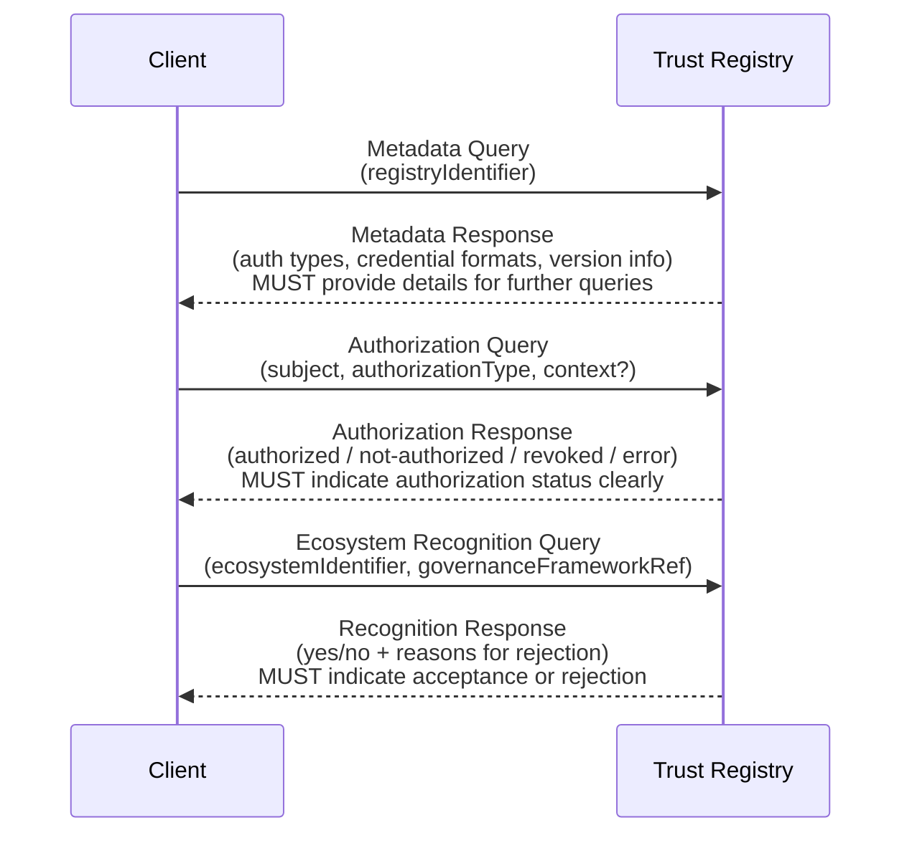

## Terms and Definitions
_This section is informative._

 [[def:authorization relationship, authorization relationships]]
~ An authority statement asserting the authorization an authority grants to another party over which it has authority.

 [[def:authorization query, authorization queries]]
~ A request for an authority statement asserting an authorization relationship or a delegation relationship.

 [[def:authority state, authority states]]
~ The set of authority statements that describe a particular entity at a particular point in time.

 [[def:authority statement, authority statements]]
~ An assertion by an authority about either: a) the authorization or delegation it grants to another party over which it has authority, or b) the recognition it gives to a peer about the scope of that peer's authority.

 [[def:delegation relationship, delegation relationships]]
~ An authority statement asserting the rights an authority delegates to another party over which it has authority.

 [[def:digital trust ecosystem, digital trust ecosystems]]
~ A [digital ecosystem](https://glossary.trustoverip.org/#term:digital-ecosystem) in which participants are one or more interoperating [trust communities](https://glossary.trustoverip.org/#term:trust-communities). Governance of various [roles](https://glossary.trustoverip.org/#term:roles) within this ecosystem is typically managed by a [governing body](https://glossary.trustoverip.org/#term:governing-body) using a [governance framework](https://glossary.trustoverip.org/#term:governance-framework). Many digital trust ecosystems maintain one or more [trust registries](https://glossary.trustoverip.org/#term:trust-registries).

 [[def:ecosystem]]
~ See [[ref:digital trust ecosystem]].

 [[def:ecosystem governance framework, ecosystem governance frameworks]]
~ A [governance framework](https://glossary.trustoverip.org/#term:governance-framework) for a [digital trust ecosystem](https://glossary.trustoverip.org/#term:digital-trust-ecosystem). This may incorporate other types of frameworks such as [credential governance frameworks](https://glossary.trustoverip.org/#term:credential-governance-framework).

 [[def:inter-ecosystem]]
~ An adjective describing relationships and data exchanges between participants in two or more separate ecosystems operating under separate governance frameworks.

 [[def:intra-ecosystem]]
~ An adjective describing relationships and data exchanges between participants operating within the same ecosystem and the same governance frameworks.

 [[def:hierarchical authority relationship, hierarchical authority relationships]]
~ A unilateral and exclusive relationship between an authority and another party subject to that authority. The authority is the only one who can grant or revoke authorization from the authorized party.

 [[def:metadata query, metadata queries]]
~ A request for an authority statement describing an entity.

 [[def:recognition relationship, recognition relationships]]
~ A heterarchical authority relationship between two peer authorities, each authoritative for their own ecosystem. This relationship can be unilateral or bilateral and is non-exclusive. One authority attests to the other's authority in one or both directions.

 [[def:recognition query, recognition queries]]
~ A request for an authority statement asserting an recognition relationship.

 [[def:TRQP binding, TRQP bindings]]
~ A technical specification defining how to implement the TRQP Core protocol over a specific transport protocol.

 [[def:TRQP bridge, TRQP bridges]]
~ A system that connects a [[ref:TRQP endpoint]] to a [[ref:system of record]]. The bridge transforms a TRQP query into the query format supported by the system of record. It also performs the reverse mapping for the response.

 [[def:TRQP Core]]
~ The foundational specification that defines core data models, queries, and security requirements for the Trust Registry Query Protocol.

 [[def:TRQP consumer]]
~ A network device (client or server) that send TRQP queries to a TRQP endpoint.

 [[def:TRQP endpoint]]
~ The network service endpoint for trust registry that speaks TRQP.

 [[def:system of record, systems of record]]
~ An authoritative source for the authority statements governing the participants in a digital trust ecosystem.

## Scope
_This section is informative._

Figure 1 illustrates the four primary components involved with TRQP architecture.


**Figure 1:** The primary components involved in TRQP architecture.

The scope of this specification is limited to the TRQP protocol operating between TRQP consumers and TRQP endpoints representing addressable TRQP trust registries. The following are out-of-scope:

* **Systems of record**. This specification casts no requirements on how the system of record is designed or deployed. Also, because TRQP is read-only, this specification does not address create, update, or delete operations for the system of record.
* **TRQP bridges**. If the system of record is not a native TRQP trust registry, a TRQP bridge is needed to transform a TRQP query into the query format supported by the system of record. Seperate specifications may be published for popular TRQP bridges, however they are out-of-scope for this specification.


## High-Level Architecture 
*This section is informative.*

Figure 2 illustrates the relationships between the core concepts in TRQP architecture.


*Figure 2: Overview of the core concepts in TRQP architecture*

### Ecosystem Governing Authorities and Trust Registry Operators

At the top of Figure&nbsp;2 are the two primary actors involved in TRQP infrastructure—the **ecosystem governing authority** and the **trust registry operator**. From a legal standpoint, they are the real-world entities with ultimate responsibility for the infrastructure that will serve the authority statements. Key considerations about these two roles:

- **Both roles can be played by the same entity.** Although the roles are shown separately in Figure&nbsp;2, the ecosystem [governing authority](https://glossary.trustoverip.org/#term:governing-body) may also serve as the trust registry operator. If the ecosystem chooses to use a separate trust registry operator, then from a ToIP governance architecture standpoint, the operator serves as an [administering authority](https://glossary.trustoverip.org/#term:administering-body).
- **The legal responsibilities of these actors—including liability and indemnity—depend on the ecosystem governance framework** and any specific contractual terms it requires. Those considerations are out-of-scope for this specification.
- **An ecosystem may be served by multiple trust registries and a trust registry may serve multiple ecosystems.** This multiplicity can be especially helpful when designing a group of related ecosystems.
- **Both roles publish authority statements—however it is important to distinguish between them.** The ecosystem governing authority is authoritative for statements describing or implementing the policies in the ecosystem governance framework, while the trust registry operator is authoritative for metadata statements describing the capabilities and operations of the trust registry itself (those that are under the operator’s sole control).

### Ecosystem IDs and Trust Registry IDs

Interoperability of TRQP across decentralized digital trust ecosystems depends on globally unique identifiers the same way interoperability of the Internet depends on globally unique identifiers (IP addresses and DNS names). Unique IDs are particularly important in TRQP architecture since they are the root of every authority statement (see [Standard Structure](#standard-structure)).

- An **ecosystem ID** uniquely identifies a digital trust ecosystem.  
- A **trust registry ID** uniquely identifies a trust registry.

Normative requirements for these identifiers appear in [Authority IDs and Entity IDs](#authority-ids-and-entity-ids).

### Authority Statements

Authority statements are the critical pieces of information stored in trust registries for the benefit of all participants in a digital trust ecosystem. As shown in Figure&nbsp;2, both ecosystem governing authorities and trust registry operators can publish authority statements. The standard structure and vocabulary of TRQP authority statements is defined in [Authority Statements and Query Vocabulary](#authority-statements-and-query-vocabulary).


## Authority Statements and Query Vocabulary
*This section is normative.*

Authority statements in TRQP are designed to communicate essential information about authorizations, delegations, recognitions, and descriptions (metadata). They share a consistent three-part structure and employ a standardized vocabulary for querying.

### Standard Structure

Interoperability across ecosystems requires shared semantics for querying authority statements. Therefore, TRQP authority statements are structured in three standard parts as shown below:


*Figure 3: The standard three-part structure of TRQP authority statements*

These three strings are simple yet flexible enough to express all types of authority statements, including authorization, recognition, delegation, and description (metadata), as defined in this section.

### Authority IDs and Entity IDs

Every authority statement is made by an authority **about** an entity. Therefore, the characteristics of these two identifiers are especially important:

#### Authority ID
- **MUST** be a globally unique identifier for the authority making the statement.  
- **MUST** be represented as a single string conforming to [IETF RFC&nbsp;3986](https://datatracker.ietf.org/doc/html/rfc3986).  
- Should be a cryptographically verifiable identifier (e.g., DID or AID) or an HTTPS URL, so that verifiers can resolve and verify public keys, TRQP service endpoints, and other metadata describing the authority.  
- It is recommended to use multi-anchoring of the verifiable identifier for additional assurance (for example, using [High Assurance DIDs using DNS](https://www.ietf.org/archive/id/draft-carter-high-assurance-dids-with-dns-03.html) or equivalent).

#### Entity ID
- **MUST** be unique **within** the ecosystem.  
  - If correlation across ecosystems is desirable (for example, to establish the reputation of a credential issuer), then it is recommended to be globally unique.  
  - If correlation across ecosystems is **not** desirable (for example, for individual privacy), then it is recommended to be a locally unique identifier.  
- **MUST** be represented as a single string conforming to [IETF RFC&nbsp;3986](https://datatracker.ietf.org/doc/html/rfc3986).  
- Should be a cryptographically verifiable identifier (e.g., DID or AID) or an HTTPS URL, so that verifiers can resolve public keys, service endpoints, and other metadata describing the entity.

### Authorization Statements

In an authorization statement, an authority grants an authorization to an entity under its authority. In the ToIP governance model, this entity is called a [governed party](https://glossary.trustoverip.org/#term:governed-party).

#### ABNF (Authorization Assertions)
```txt
auth-assertion = authorization “/” scope
authorization  = segment         ; as defined in RFC 3986
scope          = URI-reference   ; as defined in RFC 3986
```

### Authorization Assertions for Verifiable Digital Credentials

The following enumerated strings SHOULD be used for authorization assertions governing verifiable digital credentials:

`auth-string	= "issue" / "verify"`

- The `issue` string SHOULD be used for an entity authorized to act in the role of issuing a digital credential as defined in the specification for the relevant digital credential format.
- The `verify` string SHOULD be used for an entity authorized to act in the role of verifying a digital credential as defined in the specification for the relevant digital credential format.
- The `scope` of an digital credential authorization assertion SHOULD define the type of digital credential the entity is authorized to issue or verify. It is RECOMMENDED to:

1. Use the same URI string that uniquely defines the credential type as defined in the appropriate credential specification or type definition.  
2. Publish that URI string in the ecosystem governance framework and any associated type catalogues.

### Authorization Assertions for Other Verifiable Data

The following enumerated strings SHOULD be used for authorization assertions governing other forms of verifiable data:

`auth-string	= "publish" / "consume"`

- The `publish` string SHOULD be used for an entity authorized to act in the role of publishing and digitally signing verifiable data that is not in a digital credential format.
- The `consume` string SHOULD be used for an entity authorized to act in the role of requesting, verifying, and using digitally signing verifiable data that is not in a digital credential format.
- The `scope` of a verifiable data authorization assertion SHOULD define the type of verifiable data an entity is authorized to issue or verify. It is RECOMMENDED to:

1. Use the same URI string that uniquely defines the verifiable data type as defined in the appropriate specification or type definition.  
2. Publish that URI string in the ecosystem governance framework and any associated type catalogues.

#### Recognition Assertions

Recognition assertions do not have a `scope` because by definition both authorities are sovereign—neither controls the scope of the other. If two authorities have a control relationship, it **MUST** be expressed using a delegation statement.


### Delegation Statements

A delegation statement expresses a control relationship between two ecosystem governing authorities where one delegates a specific scope of authority to the other.

### 5.5.1 ABNF

The assertion in an TRQP delegation statement **MUST** be a string that conforms to the following ABNF:

```txt
deleg-assertion	= delegation "/" scope
delegation		= segment			; as defined in RFC 3986  
scope			= URI-reference		; as defined in RFC 3986
```
### Delegation Assertions
    
The following enumerated strings SHOULD be used for delegation assertions:

`deleg-string	= "delegates" / "delegated-by"`

The `delegates` string SHOULD when one ecosystem governing authority is delegating authority for a specific `scope` to another ecosystem governing authority.

The `delegated-by` string SHOULD be used to express the precise inverse delegation relationship as that expressed by the `delegates` string.

It is RECOMMENDED that a TRQP consumer verifies a `delegated-by` statement by querying the TRQP endpoint of the delegating authority for the inverse `delegates` statement.

The `scope` of a delegation assertion SHOULD identify the governance framework (or subset of a governance framework) for which authority is being delegated. It is RECOMMENDED to define and publish this URI string in the governance framework as a self-reference.


## Description (Metadata) Statements

A description statement identifies metadata stored in the trust registry that describes the identified entity. If the authority ID for the description statement is the same as the entity ID, then the description is self-asserted. If the authority ID and entity ID are different, then the authority is making an assertion that the metadata describes the entity.

Description statements can be used to lookup any relevant metadata about an entity, including metadata about the ecosystem governing authority, the ecosystem governance framework, the trust registry operator, the trust registry, or any governed party in the ecosystem.


### ABNF (Description Assertions)

The assertion in a TRQP description statement **MUST** be a string that conforms to the following ABNF: 

```txt
desc-assertion = description
description    = URI-reference   ; as defined in RFC 3986
```

### Generic Metadata Assertions

The following enumerated string SHOULD be used to query for generic metadata:

`desc-string	= "metadata"`

A TRQP description query with the `metadata` assertion **MUST** return the metadata
for the entity ID as asserted by the authority ID.

### Verification Metadata Assertions

Certain types of verifiable identifiers, called [self-certifying identifiers](https://glossary.trustoverip.org/#term:self-certifying-identifier) (SCIDs), have defined formats for their associated verification metadata. Two examples are KERI AIDs \[normative-reference\] and [did:scid DIDs](https://lf-toip.atlassian.net/wiki/spaces/HOME/pages/88572360/DID+SCID+Method+Specification) \[normative-reference\]. The following enumerated string SHOULD be used to query for the verification metadata for a SCID:

> **Important:** For a SCID, “self-asserted” vs. “witnessed” verification metadata must be queried by specifying the correct authority ID (the SCID itself vs. the witness).

### Verifiable Credential Assertions

Trust registries can also store verifiable credentials describing any entity. To query for a specific credential type:

1. The authority ID should be the **issuer** of the credential.  
2. The assertion should be the **URI reference** identifying the credential type.  
3. The entity ID must be the **subject** of the credential.


## Metadata Models

### Trust Registry
_This section is normative._

* **Properties**
  * **id: MUST** be a globally unique identifier for the registry (e.g., URI, DID, UUID)
  * **ecosystem: SHOULD** indicate which ecosystem(s) the registry serves or recognizes
  * **controller: SHOULD** reference the entity that manages or operates the registry

### Ecosystem
_This section is normative_

* **Properties**
  * **id: MUST** be a globally unique identifier for the registry (e.g., URI, DID, UUID)
  * **egf_id: MUST** specify a *resolvable* EGF identifier referencing the official EGF document
  * **trustregistries: MUST** provide a list of authorized Trust Registries that serve the ecosystem authority state [[ref:Authority State]]
    * Each registry **MUST** have the following properties:
      * **endpoint**: The address (URL, DID, etc.) for TRQP queries [[ref:Authority Query]] / [[ref:Recognition Query]]
    * Each registry **MAY** also be scoped to a particular set of authorization states as defined in the Binding [[ref:TRQP Binding]]
  * **controller: SHOULD** include a method of validating ecosystem controllers

## Baseline Requirements For Conformance

### Trust Registry
_This section is normative_

* All TRQP registries **MUST** provide an addressable endpoint resolvable as defined by the Implementation Profile
* All Trust Registries **MUST** supply the required interfaces described in the Required Interfaces section over the *same* addressable endpoint to be TRQP conformant

### TRQP Binding
_This section is normative_

* All compliant [[ref:TRQP Binding]]s **MUST** support the required interfaces described in the Required Interfaces section
* A compliant [[ref:TRQP Binding]] **MUST** comply with [[ref:TRQP Core]] requirements
* A compliant [[ref:TRQP Binding]] **MUST** support versioning using [Semantic Versioning 2.0](https://semver.org/)

### TRQP Profiles
_This section is normative_

* All TRQP profiles **MUST** specify a compliant [[ref:TRQP Binding]]

## Required Interfaces
_This section is normative_

Below are abstract API methods that **MUST** be exposed. Each **[[ref:TRQP Binding]]** **MUST** define a binding (e.g., REST, gRPC, DIDComm) that maps these methods to actual endpoints.



**Figure 5:** Sequence diagram showing interactions between a client and Trust Registry for the required interfaces.

### Metadata Query
_This section is normative_

* **Request**:  
  There are no mandatory request parameters.  
  * Optionally, an `ecosystem_id` can specify that the metadata request should be interpreted within a specific ecosystem's governance framework context [[ref:Ecosystem Governance Framework]]

* **Response**:  
  * `id`: string. Uniquely identifies the registry. If an `ecosystem_id` is provided, the response must clearly reflect that the returned data is scoped to the specified ecosystem (e.g., "ecosystem A").

### Authorization Query
_This section is normative_

* **Request**:
  * **ecosystem_id**: string. An ecosystem identifier as defined in the TRQP Binding.  
    - *Example*: `"ecosystem_id": "ecosystem A"`
  * **authorization_id**: string. Must match one of the defined authorization types in the TRQP Binding.  
    - *Example*: `"authorization_id": "credential-A-issuer"`
  * **entity_id**: string. Identifies the entity for which the authorization is being queried.  
    - *Example*: `"entity_id": "random-id-1234"`
  * **time**: string (optional). Specifies when the Trust Registry should evaluate the authority query.
    * If supplied, must adhere to the required time format (e.g., RFC3339 UTC)
    * If omitted, the system must use the current time and include that timestamp in its response

* **Response**:  
  A status indicating the entity's authorization:
  - **authorized**
  - **not-authorized**
  - **revoked**
  - **unknown-subject**
  - **error**  
  
  Optionally, the response may include additional details on validity or supporting proof references.

* **Behavior**:  
  The system **MUST** clearly indicate whether the subject holds the specified authorization.

### Ecosystem Recognition Query
_This section is normative_

* **Request**:
  * **ecosystem_id**: string. The identifier for the ecosystem, defined in the TRQP Binding.  
    - *Example*: `"ecosystem_id": "ecosystem A"`
  * **target_ecosystem_id**: string (optional). Another ecosystem identifier against which recognition is being evaluated.
  * **scope**: string (optional). Can filter or narrow the request. The specification doesn't enforce a specific structure for scopes, but individual profiles may define their own conventions.
  * **time**: string (optional). May be provided as described in the TRQP Binding guidelines.

* **Response**:  
  The recognition status of the ecosystem:
  - **accepted** (if recognized)
  - **rejected** (if not)  
  
  Additional supporting details, such as proof references or log entries, may be included.

* **Behavior**:  
  The system **MUST** return a clear yes/no answer regarding ecosystem recognition, and **MAY** provide further explanation as specified in the TRQP Binding.
