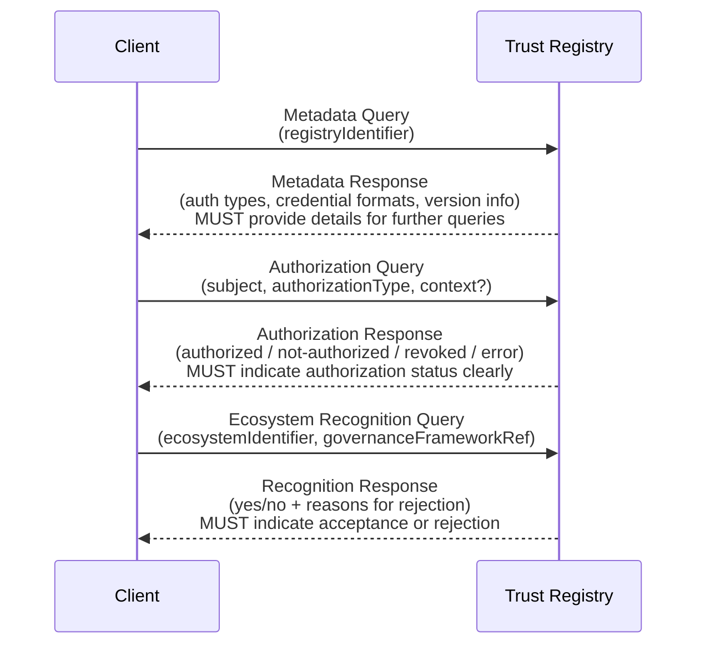

## Terms and Definitions
_This section is informative._

 [[def:authorization relationship, authorization relationships]]
~ An authority statement asserting the authorization an authority grants to another party over which it has authority.

 [[def:authorization query, authorization queries]]
~ A request for an authority statement asserting an authorization relationship or a delegation relationship.

 [[def:authority state, authority states]]
~ The set of authority statements that describe a particular entity at a particular point in time.

 [[def:authority statement, authority statements]]
~ An assertion by an authority about either: a) the authorization or delegation it grants to another party over which it has authority, or b) the recognition it gives to a peer about the scope of that peer's authority.

 [[def:delegation relationship, delegation relationships]]
~ An authority statement asserting the rights an authority delegates to another party over which it has authority.

 [[def:digital trust ecosystem, digital trust ecosystems]]
~ A [digital ecosystem](https://glossary.trustoverip.org/#term:digital-ecosystem) in which participants are one or more interoperating [trust communities](https://glossary.trustoverip.org/#term:trust-communities). Governance of various [roles](https://glossary.trustoverip.org/#term:roles) within this ecosystem is typically managed by a [governing body](https://glossary.trustoverip.org/#term:governing-body) using a [governance framework](https://glossary.trustoverip.org/#term:governance-framework). Many digital trust ecosystems maintain one or more [trust registries](https://glossary.trustoverip.org/#term:trust-registries).

 [[def:ecosystem]]
~ See [[ref:digital trust ecosystem]].

 [[def:ecosystem governance framework, ecosystem governance frameworks]]
~ A [governance framework](https://glossary.trustoverip.org/#term:governance-framework) for a [digital trust ecosystem](https://glossary.trustoverip.org/#term:digital-trust-ecosystem). This may incorporate other types of frameworks such as [credential governance frameworks](https://glossary.trustoverip.org/#term:credential-governance-framework).

 [[def:inter-ecosystem]]
~ An adjective describing relationships and data exchanges between participants in two or more separate ecosystems operating under separate governance frameworks.

 [[def:intra-ecosystem]]
~ An adjective describing relationships and data exchanges between participants operating within the same ecosystem and the same governance frameworks.

 [[def:hierarchical authority relationship, hierarchical authority relationships]]
~ A unilateral and exclusive relationship between an authority and another party subject to that authority. The authority is the only one who can grant or revoke authorization from the authorized party.

 [[def:metadata query, metadata queries]]
~ A request for an authority statement describing an entity.

 [[def:recognition relationship, recognition relationships]]
~ A heterarchical authority relationship between two peer authorities, each authoritative for their own ecosystem. This relationship can be unilateral or bilateral and is non-exclusive. One authority attests to the other's authority in one or both directions.

 [[def:recognition query, recognition queries]]
~ A request for an authority statement asserting an recognition relationship.

 [[def:TRQP binding, TRQP bindings]]
~ A technical specification defining how to implement the TRQP Core protocol over a specific transport protocol.

 [[def:TRQP bridge, TRQP bridges]]
~ A system that connects a [[ref:TRQP endpoint]] to a [[ref:system of record]]. The bridge transforms a TRQP query into the query format supported by the system of record. It also performs the reverse mapping for the response.

 [[def:TRQP Core]]
~ The foundational specification that defines core data models, queries, and security requirements for the Trust Registry Query Protocol.

 [[def:TRQP consumer]]
~ A network device (client or server) that send TRQP queries to a TRQP endpoint.

 [[def:TRQP endpoint]]
~ The network service endpoint for trust registry that speaks TRQP.

 [[def:system of record, systems of record]]
~ An authoritative source for the authority statements governing the participants in a digital trust ecosystem.

## Scope
_This section is informative._

Figure 1 illustrates the four primary components involved with TRQP architecture.

**Figure 1:** The primary components involved in TRQP architecture.

The scope of this specification is limited to the TRQP protocol operating between TRQP consumers and TRQP endpoints representing addressable TRQP trust registries. The following are out-of-scope:

* **Systems of record**. This specification casts no requirements on how the system of record is designed or deployed. Also, because TRQP is read-only, this specification does not address create, update, or delete operations for the system of record.
* **TRQP bridges**. If the system of record is not a native TRQP trust registry, a TRQP bridge is needed to transform a TRQP query into the query format supported by the system of record. Seperate specifications may be published for popular TRQP bridges, however they are out-of-scope for this specification.

## High-Level Architecture 
*This section is informative.*

Figure 2 illustrates the relationships between the core concepts in TRQP architecture.

*Figure 2: Overview of the core concepts in TRQP architecture*

### Ecosystem Governing Authorities and Trust Registry Operators

At the top of Figure&nbsp;2 are the two primary actors involved in TRQP infrastructure—the **ecosystem governing authority** and the **trust registry operator**. From a legal standpoint, they are the real-world entities with ultimate responsibility for the infrastructure that will serve the authority statements. Key considerations about these two roles:

- **Both roles can be played by the same entity.** Although the roles are shown separately in Figure&nbsp;2, the ecosystem [governing authority](https://glossary.trustoverip.org/#term:governing-body) may also serve as the trust registry operator. If the ecosystem chooses to use a separate trust registry operator, then from a ToIP governance architecture standpoint, the operator serves as an [administering authority](https://glossary.trustoverip.org/#term:administering-body).
- **The legal responsibilities of these actors—including liability and indemnity—depend on the ecosystem governance framework** and any specific contractual terms it requires. Those considerations are out-of-scope for this specification.
- **An ecosystem may be served by multiple trust registries and a trust registry may serve multiple ecosystems.** This multiplicity can be especially helpful when designing a group of related ecosystems.
- **Both roles publish authority statements—however it is important to distinguish between them.** The ecosystem governing authority is authoritative for statements describing or implementing the policies in the ecosystem governance framework, while the trust registry operator is authoritative for metadata statements describing the capabilities and operations of the trust registry itself (those that are under the operator’s sole control).

## Metadata Models

### Trust Registry
_This section is normative._

* **Properties**
  * **id: MUST** be a globally unique identifier for the registry (e.g., URI, DID, UUID)
  * **ecosystem: SHOULD** indicate which ecosystem(s) the registry serves or recognizes
  * **controller: SHOULD** reference the entity that manages or operates the registry

### Ecosystem
_This section is normative_

* **Properties**
  * **id: MUST** be a globally unique identifier for the registry (e.g., URI, DID, UUID)
  * **egf_id: MUST** specify a *resolvable* EGF identifier referencing the official EGF document
  * **trustregistries: MUST** provide a list of authorized Trust Registries that serve the ecosystem authority state [[ref:Authority State]]
    * Each registry **MUST** have the following properties:
      * **endpoint**: The address (URL, DID, etc.) for TRQP queries [[ref:Authority Query]] / [[ref:Recognition Query]]
    * Each registry **MAY** also be scoped to a particular set of authorization states as defined in the Binding [[ref:TRQP Binding]]
  * **controller: SHOULD** include a method of validating ecosystem controllers

## Baseline Requirements For Conformance

### Trust Registry
_This section is normative_

* All TRQP registries **MUST** provide an addressable endpoint resolvable as defined by the Implementation Profile
* All Trust Registries **MUST** supply the required interfaces described in the Required Interfaces section over the *same* addressable endpoint to be TRQP conformant

### TRQP Binding
_This section is normative_

* All compliant [[ref:TRQP Binding]]s **MUST** support the required interfaces described in the Required Interfaces section
* A compliant [[ref:TRQP Binding]] **MUST** comply with [[ref:TRQP Core]] requirements
* A compliant [[ref:TRQP Binding]] **MUST** support versioning using [Semantic Versioning 2.0](https://semver.org/)

### TRQP Profiles
_This section is normative_

* All TRQP profiles **MUST** specify a compliant [[ref:TRQP Binding]]

## Required Interfaces
_This section is normative_

Below are abstract API methods that **MUST** be exposed. Each **[[ref:TRQP Binding]]** **MUST** define a binding (e.g., REST, gRPC, DIDComm) that maps these methods to actual endpoints.

**Figure 5:** Sequence diagram showing interactions between a client and Trust Registry for the required interfaces.

### Metadata Query
_This section is normative_

* **Request**:  
  There are no mandatory request parameters.  
  * Optionally, an `ecosystem_id` can specify that the metadata request should be interpreted within a specific ecosystem's governance framework context [[ref:Ecosystem Governance Framework]]

* **Response**:  
  * `id`: string. Uniquely identifies the registry. If an `ecosystem_id` is provided, the response must clearly reflect that the returned data is scoped to the specified ecosystem (e.g., "ecosystem A").

Interoperability of TRQP across decentralized digital trust ecosystems depends on globally unique identifiers the same way interoperability of the Internet depends on globally unique identifiers (IP addresses and DNS names). Unique IDs are particularly important in TRQP architecture since they are the root of every authority statement (see [Standard Structure](#standard-structure)).

- An **ecosystem ID** uniquely identifies a digital trust ecosystem.  
- A **trust registry ID** uniquely identifies a trust registry.

Normative requirements for these identifiers appear in [Authority IDs and Entity IDs](#authority-ids-and-entity-ids).

