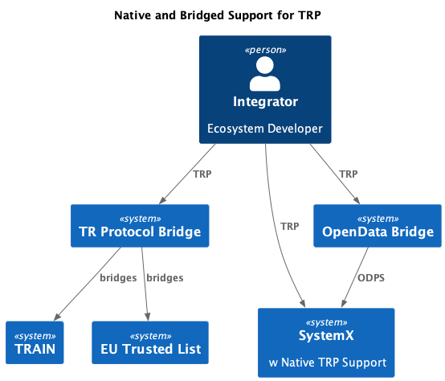

# TRQP Core Specification

## Scope

The Trust Registry Query Protocol (TRQP) provides an abstract, interoperable framework for verifying authorization statuses across different digital ecosystems. TRQP **DOES NOT** replace existing intra-ecosystem trust solutions; rather, it defines a minimal set of queries, data models, and flows to bridge these ecosystems.

This specification includes:

1. **Core Patterns** for bridging.  
2. **Abstract Data Models** that define common structures (e.g., registry metadata, authorizations).  
3. **Required Interfaces (APIs)** for cross-ecosystem queries.  
4. **Security Considerations** relevant to the protocol.  
5. **Conformance Criteria** for determining whether an implementation fully supports TRQP.  
6. **Implementation Profiles** guidance, describing how ecosystems can map abstract TRQP interfaces to concrete protocols (e.g., REST, DIDComm, gRPC).

This document does **NOT** define:
- **Concrete Transport Details** (e.g., HTTP status codes, message encryption, DIDComm envelopes). 
- **Bridging Mechanics** (e.g., how an existing trust framework is connected to TRQP). 
- **Discovery Mechanisms** (e.g., DNS-based or DID-based lookup). 

Implementers **MUST** reference the relevant implementation profile(s) to see how these abstract requirements translate into actual endpoints or transport protocols.

---

## Terms and Definitions

In addition to the terms defined below, references to “MUST,” “SHOULD,” and “MAY” are to be interpreted as described in [RFC 2119](https://datatracker.ietf.org/doc/html/rfc2119).

- **Inter-Ecosystem Trust**: Trust relationships established across different ecosystems or frameworks.  
- **Intra-Ecosystem Trust**: Trust relationships established within a single ecosystem or framework.  
- **Ecosystem**: A collection of entities, rules, and trust registries operating under a common governance framework.  
- **Recognition**: Acknowledgment by one ecosystem of another ecosystem’s governance rules and trust registries.  
- **Authority Query**: A request to verify if an entity (subject) holds a specific authorization.  
- **Authority State**: The stored or asserted status indicating whether an entity has a valid authorization.  
- **TRQP Implementation Profile**: A document describing concrete protocol bindings, data formats, and any ecosystem-specific mapping required to achieve TRQP compliance.  
- **Bridging**: The process or mechanism by which a local ecosystem or trust framework is integrated with TRQP queries for cross-ecosystem or cross-framework validation.

---

## Introduction

Modern digital ecosystems rely on diverse intra-ecosystem trust frameworks (e.g., OpenID Federation, X.509 Chains, EBSI Trust Chains, TRAIN). These frameworks typically operate within a single ecosystem’s boundaries, verifying whether a subject is authorized under that ecosystem’s governance. However, as organizations expand and collaborate, they encounter the need to verify authorizations **across** different ecosystems with potentially incompatible rules and data formats.

TRQP addresses this gap with a common, minimal set of “bridge” queries. TRQP queries allow a verifier to answer:

> “Does Entity X have Authorization Y under Ecosystem Z’s governance framework?”

TRQP is ecosystem-agnostic and **does not** prescribe how an ecosystem internally manages its trust registry or cryptographic keys. Instead, TRQP **defines**:

1. **Core Queries** (Metadata, Authorization, Ecosystem Recognition).  
2. **Abstract Data Models** (e.g., how to represent an authorization or registry metadata).  
3. **Flows** for cross-ecosystem bridging.

By standardizing these elements, TRQP ensures consistent cross-ecosystem authorization checks while allowing each ecosystem to retain its preferred technologies, governance structures, and cryptographic tools.

---

## High-Level Architecture

A TRQP **implementation profile** **MUST** enable the ability for different ecosystem adapters (“bridges”) to connect to the profile. The figure below demonstrates a conceptual architecture where an integrator builds a gateway between a local ecosystem and a TRQP-compliant ecosystem.

> **Note**: The bridging mechanics—how exactly the local ecosystem integrates with TRQP—are out of scope for this specification. Implementers **MAY** use REST-based proxies, DIDComm agents, message queues, or any other bridging technology.


```text
+-----------------+                +-------------------+
| Local Ecosystem | -- (bridge) -->| TRQP-Compliant    |
|   (Intra-Trust) |                | Ecosystem         |
+-----------------+                +-------------------+
```

### Ecosystem

Each ecosystem **maintains**:
- **Authority State**: The internal records or logic that describe which subjects are authorized, for what roles, under what policy conditions.  
- **Governance Framework**: Rules for identity, credential issuance, revocation, etc.  
- **Trust Registries**: The authoritative repositories or services that confirm subject authorizations.

### Trust Registry

A **trust registry** holds authorization details (e.g., valid, revoked). The registry is **controlled** by an entity or consortium recognized within the ecosystem. The trust registry’s internal data model typically reflects that ecosystem’s governance rules.

### Bridging Mechanism

TRQP standardizes cross-ecosystem queries while leaving each ecosystem’s internal details intact. The bridging mechanism is any intermediary or adapter that transforms local queries into TRQP queries and interprets TRQP responses back into the local ecosystem’s format.



---

## Core Patterns

The TRQP design supports three primary flows (with additional optional flows):

1. **Request Ecosystem Recognition**  
2. **Query Entity Authorization**  
3. **Trust Registry Metadata Lookup**  

Implementations **MAY** add more queries based on ecosystem requirements (e.g., retrieving revocation logs, querying intermediate trust anchors), but **MUST** support the three above for TRQP compliance.

> **Important**: TRQP **does not** define how trust registries are discovered; this is left to implementers (DNS, DID-based resolvers, well-known endpoints, etc.). However, the discovery method **MUST** be documented in the relevant implementation profile.

---

## Abstract Data Models

This section defines the core data structures each TRQP-capable ecosystem or registry **MUST** understand. Concrete serialization (JSON, JSON-LD, Protobuf, etc.) is handled by the **TRQP Implementation Profile**.

### Metadata (Registry Metadata)

**Purpose**: Describe a trust registry’s capabilities so a querying party understands which authorizations, credential types, or versions are recognized.

**Data Model**:

| Property             | Requirement           | Description                                                                                                                                   |
|----------------------|-----------------------|-----------------------------------------------------------------------------------------------------------------------------------------------|
| `id`                 | **MUST**             | Globally unique identifier for the registry (e.g., URL, DID, UUID).                                                                           |
| `ecosystem`          | **SHOULD**           | The ecosystem or ecosystems served by this registry.                                                                                          |
| `controller`         | **MUST**             | Identifier of the registry’s controlling entity (organization, DID, etc.).                                                                    |
| `serviceEndpoint`    | **MUST**             | One or more endpoints (URL, DIDComm, etc.) where TRQP queries can be sent.                                                                    |
| `supportedAuthTypes` | **MAY**              | A list of recognized authorization types (e.g., “NotaryRole,” “InsuranceLicense,” etc.).                                                      |
| `supportedFormats`   | **MAY**              | Credential or proof formats supported (e.g., JWT, JSON-LD, X.509).                                                                            |
| `versionInfo`        | **MAY**              | Version or release notes indicating registry iteration(s).                                                                                    |
| `integrity`          | **MAY**              | A checksum, signature, or hash to validate metadata authenticity.                                                                             |

> **Note**: Additional fields **MAY** be added by ecosystem-specific profiles.

### Ecosystem Governance Framework (EGF)

**Purpose**: Establish the rules by which a given ecosystem operates, including recognized registries and proof of control.

1. **EGF URI (Canonical Reference)**  
   - **MUST** define a stable URI referencing the EGF document. This could be an HTTP(S) URL or a DID-based URI.  

2. **Proof of Ecosystem Control**  
   - **MUST** include cryptographic evidence (e.g., a public key, verifiable credential) proving the publishing entity controls the ecosystem.  

3. **List of Recognized Trust Registries**  
   - **MUST** include a list of trust registries (with endpoints, integrity checks, and recognized scopes).  

4. **Proof of Registry Relationship**  
   - **MUST** provide verifiable linkage (signatures, references) to confirm that each listed registry is valid under this EGF.  

5. **Versioning and Lifecycle Management**  
   - **MUST** define how the EGF is updated and how old or compromised registries are revoked.  

### Authorization

Each authorization record expresses that a subject holds a particular role or credential under an ecosystem’s governance framework.

| Property            | Requirement  | Description                                                                                       |
|---------------------|--------------|---------------------------------------------------------------------------------------------------|
| `subject`           | **MUST**     | Identifier of the entity (e.g., DID, unique ID) for whom the authorization is granted.            |
| `authorizationType` | **MUST**     | The specific role, credential type, or permission (e.g., “DriverLicense,” “NotaryRole”).           |
| `validFrom`         | **SHOULD**   | ISO 8601 date/time indicating when the authorization becomes valid.                                |
| `validUntil`        | **SHOULD**   | ISO 8601 date/time indicating when the authorization expires.                                     |
| `proof`             | **MUST**     | Cryptographic proof (signature, credential) confirming the authorization’s authenticity.          |
| `status`            | **MUST**     | Enumeration or field reflecting whether the authorization is active, revoked, or unknown.         |
| `revocationInfo`    | **MAY**      | Data about where or how revocation is tracked (registry URL, timestamp, signature).               |

---

## Required Interfaces

TRQP defines three **MUST**-implement abstract APIs. An **Implementation Profile** binds each of these to a specific transport or protocol.

### Metadata Query

- **Purpose**: Retrieve general or specific information about a trust registry’s capabilities.  
- **Request Parameters**:  
  1. **registryIdentifier** — The unique ID (URI, DID, etc.) for the registry whose metadata is being requested.
- **Response**:  
  - **success**: Returns the metadata object (see [6.1 Metadata (Registry Metadata)](#61-metadata-registry-metadata)).  
  - **error**: Returns an error object with an explanation (e.g., “registry not found,” “unauthorized request”).

### Authorization Query

- **Purpose**: Check if a subject has a particular authorization or role recognized by the registry.  
- **Request Parameters**:  
  1. **subject** — The entity being queried (identifier, DID, etc.).  
  2. **authorizationType** — The specific authorization or role type to validate.  
  3. **context** (optional) — Additional context (e.g., the environment or reason for the query).
- **Response**:  
  - **status** — One of `authorized | not-authorized | revoked | unknown-subject | error`.  
  - **validity** — (Optional) Timestamps or other relevant details if authorized.  
  - **proofReference** — (Optional) If the registry issues a cryptographic proof or reference.

### Ecosystem Recognition Query

- **Purpose**: Determine if one ecosystem (or registry) is recognized by another.  
- **Request Parameters**:  
  1. **ecosystemIdentifier** — The ecosystem in question.  
  2. **governanceFrameworkRef** — A reference to the EGF (URI, DID, etc.).  
- **Response**:  
  - **result** — `recognized | not-recognized`  
  - **reason** — (Optional) Explanation if not recognized (e.g., “missing trust anchor,” “framework mismatch,” “registry not in EGF list”).

---

## Error Handling

While specific error codes are transport-dependent, a TRQP interface **MUST** communicate errors clearly. Common error categories include:

- **Invalid Request**: The input data does not match expected fields or schema.  
- **Unauthorized**: The caller lacks permissions to perform the query.  
- **Not Found**: The requested registry, subject, or ecosystem is unknown.  
- **Server Error**: Generic or internal failure during processing.

All TRQP-compliant implementations **MUST** document their error codes, messages, and recommended fallback behaviors in their **Implementation Profile**.

---

## Conformance

An implementation **claims TRQP conformance** if:

1. **All Required Interfaces**: It exposes **Metadata Query**, **Authorization Query**, and **Ecosystem Recognition Query** endpoints (or equivalent message handlers).  
2. **Correct Data Models**: It adheres to the abstract data models (registry metadata, EGF, authorization) as defined in Section 6.  
3. **Security**: It addresses the security considerations in Section 10 (e.g., uses cryptographic proofs, defends against replay attacks, logs critical events).  
4. **Profile Documentation**: It publishes or references a **TRQP Implementation Profile** that binds these abstract interfaces to a concrete technology (REST, DIDComm, etc.).

Any optional features (e.g., extended queries, advanced revocation checks) do **NOT** affect baseline conformance but **MAY** add additional interoperability value.

---

## Security Considerations

Implementers of TRQP **MUST** address the following threats:

1. **Trust Anchor Hijacking**:  
   - Use strong cryptography and rotate keys regularly.  
   - Maintain secure storage of private keys for trust anchors.  
2. **Trust Registry Bugs**:  
   - Conduct regular code reviews, automated vulnerability scanning, and thorough QA.  
3. **Trust Anchor Spoofing**:  
   - Verify all registry responses against cryptographically verified anchors or certificate chains.  
4. **Domain Hijacking**:  
   - Protect DNS entries if using DNS-based discovery (consider DNSSEC).  
5. **Replay Attacks**:  
   - Use timestamps, nonces, short-lived tokens in request/response flows.  
6. **Data Integrity**:  
   - Sign or hash critical data at rest and use TLS or equivalent in transit.  
7. **Denial of Service (DoS)**:  
   - Implement rate-limiting, usage monitoring, and scalable infrastructures.  
8. **Insufficient Data Validation**:  
   - Validate all incoming data against strict schemas and return descriptive errors on malformed requests.  
9. **Trust Anchor Compromise**:  
   - Deploy multi-tier trust anchors where possible and have robust revocation/re-key procedures.  
10. **Logging and Auditing**:  
   - Log all relevant events and monitor them in real-time for anomalies.  
11. **Protocol Downgrade Attacks**:  
   - Default to the latest secure versions and disallow fallback to insecure or outdated protocol versions.  
12. **Privacy Concerns**:  
   - Encrypt personally identifiable information.  
   - Comply with relevant privacy regulations (GDPR, HIPAA, etc.) as applicable.  
13. **Timing Attacks**:  
   - Use constant-time operations or obfuscation where feasible to avoid leaking sensitive data.

---

## Privacy Considerations

Since TRQP queries can reveal which authorizations a subject holds:

- **Data Minimization**: Registries **SHOULD** share only necessary data for confirming the subject’s authorization status, rather than returning extraneous personal information.  
- **Consent & Transparency**: Where required by law or policy, the subject **SHOULD** be informed (or have consented) that an external ecosystem may query their authorization status.  
- **Access Control**: Registries **MUST** ensure that only authorized parties can request certain authorization details (especially if such details are sensitive).  

---

## TRQP Implementation Profiles

**Definition**: A TRQP Implementation Profile is a separate document or specification that explains how an implementer maps the **abstract** TRQP requirements into a **concrete** protocol/transport (REST, gRPC, DIDComm, etc.).

### Example Profile Outline

1. **Transport Protocol**: e.g., HTTP/1.1 or HTTP/2 for REST, specifying endpoints `/metadata`, `/authorize`, `/recognition`.  
2. **Message Format**: e.g., JSON bodies with specified field names, or DIDComm V2 message structures.  
3. **Authentication & Authorization**: e.g., OAuth 2.0 Bearer tokens, mutual TLS, or DIDComm-level authentication.  
4. **Error Codes**: e.g., standard HTTP error statuses (400, 401, 404, 500) with TRQP-specific `errorType` fields.  
5. **Cryptographic Requirements**: e.g., JWS for request/response signing, recommended ciphers for TLS connections.

Any ecosystem or vendor can publish a **TRQP Implementation Profile** that interprets this specification for their context. Multiple profiles **MAY** coexist, each addressing different industries or technical stacks.

---

## Governance and Lifecycle

Because TRQP deals with trust and authority verification across potentially many organizations, governance is crucial:

1. **Version Upgrades**:  
   - The TRQP specification itself **MAY** evolve. Minor versions **SHOULD** be backward-compatible; major versions **MAY** introduce breaking changes.  
   - Ecosystems **MUST** monitor TRQP version updates and adjust their profiles accordingly.
2. **Deprecation**:  
   - Older TRQP versions or profiles **MAY** be marked as deprecated.  
   - Implementers **SHOULD** provide a transition or fallback plan to minimize disruption.
3. **Community Feedback**:  
   - Ecosystem stakeholders **SHOULD** contribute feedback to future TRQP iterations via recognized standard bodies or open forums.

---

## Normative References

- **[RFC 2119](https://www.rfc-editor.org/rfc/rfc2119)**: Key words for use in RFCs to Indicate Requirement Levels.  
- **[RFC 3986](https://www.rfc-editor.org/rfc/rfc3986)**: Uniform Resource Identifier (URI): Generic Syntax.  
- **[RFC 7519](https://www.rfc-editor.org/rfc/rfc7519)**: JSON Web Token (JWT).

Additional references **MAY** be included in an ecosystem’s TRQP Implementation Profile (e.g., regarding cryptographic libraries or W3C Verifiable Credentials).

---

## Conclusion

The **Trust Registry Query Protocol (TRQP)** provides a standardized, minimal layer for bridging trust and authorization checks across heterogeneous ecosystems. By implementing the **Required Interfaces** (Metadata Query, Authorization Query, Ecosystem Recognition Query), adhering to the **Abstract Data Models** described herein, and following the **Security and Privacy** guidelines, ecosystems can seamlessly integrate and recognize each other’s authorizations without discarding their existing trust frameworks.

- **MUST** statements are **mandatory** for compliance.  
- **SHOULD** statements are **recommended** best practices for enhanced interoperability and security.  
- **MAY** statements indicate **optional** but potentially valuable enhancements or extensions.

When combined with an ecosystem-specific **TRQP Implementation Profile** and robust governance, TRQP is a powerful enabler for multi-ecosystem cooperation in domains ranging from finance to government services and beyond.

---

## Document History (Non-Normative)

- **v1.0**: Initial public release of the TRQP Specification.  
- **v1.1 (Draft)**: Added clarifications on bridging mechanisms, expanded Data Models, introduced Privacy Considerations.
