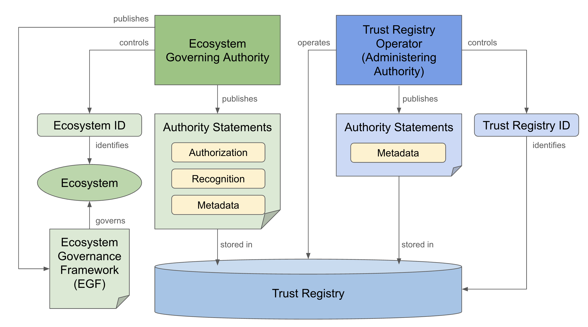

## Conventions and Definitions

### Keywords
The key words "MUST", "MUST NOT", "REQUIRED", "SHALL", "SHALL NOT", "SHOULD", "SHOULD NOT", "RECOMMENDED",  "MAY", and "OPTIONAL" in this document are to be interpreted as described in [IETF RFC 2119](https://datatracker.ietf.org/doc/html/rfc2119).

### Definitions

[[def:authority]]
~ The entity responsible for making authority statements expressing the governance policies for its trust domain or digital trust ecosystem.

[[def:authority ID]]
~ The globally unique identifier of an authority.

 [[def:authority statement, authority statements]]
~ An assertion by an authority about another entity. Types of authority statements include authorization, recognition, delegation, and description (metadata).

 [[def:authorization statement, authorization statements]]
~ An authority statement in which an authority grants an authorization to an entity over which it has authority.

 [[def:delegation statement, delegation statements]]
~ An authority statement in which an authority delegates a specific scope of authority to another entity.

 [[def:description statement, description statements]]
~ An authority statement in which an authority asserts metadata describing an entity.

 [[def:digital trust ecosystem, digital trust ecosystems]]
~ A [digital ecosystem](https://glossary.trustoverip.org/#term:digital-ecosystem) in which participants are one or more interoperating [trust communities](https://glossary.trustoverip.org/#term:trust-communities). Governance of various [roles](https://glossary.trustoverip.org/#term:roles) within this ecosystem is typically managed by a [governing body](https://glossary.trustoverip.org/#term:governing-body) using a [governance framework](https://glossary.trustoverip.org/#term:governance-framework). Many digital trust ecosystems maintain one or more [trust registries](https://glossary.trustoverip.org/#term:trust-registries).

 [[def:ecosystem]]
~ See [[ref:digital trust ecosystem]].

 [[def:ecosystem governing authority]]
~ The authority responsible for governance of a [[ref:digital trust ecosystem]] and for publishing its [[ref:authority statements]]. An ecosystem governing authority may take any legal form or may not be a formal legal entity at all.

 [[def:ecosystem governance framework, ecosystem governance frameworks]]
~ A [governance framework](https://glossary.trustoverip.org/#term:governance-framework) for a [digital trust ecosystem](https://glossary.trustoverip.org/#term:digital-trust-ecosystem). This may incorporate other types of frameworks such as [credential governance frameworks](https://glossary.trustoverip.org/#term:credential-governance-framework).

 [[def:entity ID]]
~ The unique identifier of an entity within a trust domain or [[ref:digital trust ecosystem]].

[[governance framework]]
A collection of one or more [governance documents](https://glossary.trustoverip.org/#term:governance-documents) published by the [governing body](https://glossary.trustoverip.org/#term:governing-body) of an ecosystem or any kind of [trust community](https://glossary.trustoverip.org/#term:trust-community).

 [[def:inter-ecosystem]]
~ An adjective describing relationships and data exchanges between participants in two or more separate ecosystems operating under separate governance frameworks.

 [[def:intra-ecosystem]]
~ An adjective describing relationships and data exchanges between participants operating within the same ecosystem and the same governance framework.

 [[def:recognition statement, recognition statements]]
~ An authority statement in which one authority recognizes the authority of another authority as a peer. Note that this recognition relationship may be unilateral or bilateral and is non-exclusive.

 [[def:TRQP binding, TRQP bindings]]
~ A technical specification defining how to implement the TRQP Core protocol over a specific transport protocol.

 [[def:TRQP bridge, TRQP bridges]]
~ A system that connects a [[ref:TRQP endpoint]] to a [[ref:system of record]]. The bridge transforms a TRQP query into the query format supported by the system of record and performs the reverse mapping for the response.

 [[def:TRQP Core]]
~ The foundational specification that defines core data models, query vocabulary, and other requirements for the Trust Registry Query Protocol.

 [[def:TRQP consumer]]
~ A network device (client or server) that send TRQP queries to a TRQP endpoint.

 [[def:TRQP endpoint]]
~ The network service endpoint for trust registry that speaks TRQP.

 [[def:trust registry]]
~ A repository that serves as a source for [[ref:authority statements]] or other governed information describing one or more trust communities. A trust registry is typically authorized by an [[ref:ecosystem governance framework]].

 [[def:trust registry operator]]
~ The legal entity responsible for operating a [[ref:trust registry]]. A trust registry may be operated directly by an [ref:ecosystem governing authority]], or operation may be delegated to an independent trust registry operator.

 [[def:system of record, systems of record]]
~ An authoritative source for the authority statements available from a [ref:trust registry]].

## Scope
_This section is informative._

Figure 1 illustrates the four primary components involved with TRQP architecture.

**Figure 1:** The primary components involved in TRQP architecture.

The scope of this specification is limited to the TRQP protocol operating between TRQP consumers and TRQP endpoints representing addressable TRQP trust registries. The following are out-of-scope:

* **Systems of record**. This specification casts no requirements on how the system of record is designed or deployed. Also, because TRQP is read-only, this specification does not address create, update, or delete operations for the system of record.
* **TRQP bridges**. If the system of record is not a native TRQP trust registry, a TRQP bridge is needed to transform a TRQP query into the query format supported by the system of record. Seperate specifications may be published for popular TRQP bridges, however they are out-of-scope for this specification.
* **Implmentation Code**. TRQP defines the protocol; it does not provide the code for implementation.

## REMOVE COMPLETELY? High-Level Architecture 

::: warning
TODO: DECISION
What does this section provide now? With the removal of the `trustregistry_id` confusion it needs, at minimum, to be gutted and new diagrams created. 

OR 

Do we just remove it completely and use the High Level Architecture that is in `hla.md` (Section 5 at time of writing) as a total replacement. 
:::

*This section is informative.*

In TRQP architecture, there are two primary roles involved with a TRQP-compliant
trust registry:

1. The ecosystem governing authority role (section 4.1).  
2. The trust registry operator role (section 4.2).

Both roles may be played by the same entity or by separate entities. Figure 2 is a diagram of the case where the ecosystem governing authority is also the trust registry operator. 

TODO: Adjust diagram - remove "trust registry ID" and clarify that the BLUE is "your choice". The single/multi-operator model is NOT relevant for external implementations (TRQP Consumer) and overall confusing for implementers (TRQP Producer).

*Figure 2: Case \#1, where an ecosystem governing authority operates its own trust registry*

Figure 3 is a diagram of the case where the roles are played by different
entities, i.e., the ecosystem governing authority delegates operation of the
trust registry to an independent trust registry operator.

*Figure 3: Case \#2, where a trust registry is operated by an independent trust registry operator*

### Ecosystem Governing Authority 

The ecosystem governing authority is the entity responsible for governance of the ecosystem and for publishing its authority statements. It may take any legal form or may not be a formal legal entity at all. The only requirement is that the ecosystem governing authority be recognized by the stakeholders in the
ecosystem for the purposes of its governance. 

From a TRQP architecture standpoint, the ecosystem governing authority is
responsible for:

* Publishing the ecosystem governance framework.  
* Controlling the ecosystem ID.  
* Publishing the ecosystem’s authority statements to one or more trust
  registries.

If the ecosystem governing authority chooses to operate its own trust
registr(ies), it is also responsible for the functions in section 4.2. If not, the ecosystem governing authority is responsible for delegating these
responsibilities to a trust registry operator and communicating that delegation pathway to any potential TRQP consumers. This should include publishing a delegation statement to the trust registry (section 6.4).

::: note
 If ecosystem governing authority contracts with a service provider to manage
 the physical operation of a trust registry but that service provider: a) does
 not control their own cryptographic keys independently from those of the
 ecosystem governing authority, and b) does not take on any other
 responsibilities of an administering authority, then the ecosystem governing
 authority is still serving in the role of trust registry operator.
:::

### Trust Registry Operator

As described above, the role of a trust registry operator can be performed
directly by an ecosystem governing authority or may be delegated to an
independent trust registry operator who specializes in this function. In the
latter case, from a ToIP governance architecture perspective, the trust registry
operator is serving as an [administering authority](https://glossary.trustoverip.org/#term:administering-body).

::: note
An independent trust registry operator may serve multiple ecosystem
governing authorities from the same trust registry because the authority
statements from each authority are logically independent.
:::

In all cases, the trust registry operator is responsible for:

* Controlling the trust registry ID.  
* Hosting the trust registry’s TRQP endpoints.  
* Managing the infrastructure to read and write to the registry.  
* Security, privacy, scalability, operating integrity, and availability of the trust registry.

If a trust registry operator is serving in an administering authority role, it is also responsible for:

* Its own cryptographic key management.  
* Publishing its own authority statements (as shown in figure 3), including:  
  * Delegation statements asserting its `delegated-by` relationship to each ecosystem governing authority the trust registry serves (section 6.3).  
  * Description statements asserting authoritative metadata about the trust registry (section 6.4).

### Ecosystem Governance Framework

Just as an ecosystem governing authority may take any form, so may the policies governing the ecosystem. For the purposes of this specification, the collection of these policies (whether human-readable and/or machine-readable) is called the [ecosystem governance framework](https://glossary.trustoverip.org/#term:ecosystem-governance-framework).

To facilitate [trust decisions](https://glossary.trustoverip.org/#term:trust-decision) by its stakeholders—or by any other relying party—the ecosystem governing authority is responsible for publishing the ecosystem governance framework. Although they are not normative requirements of this specification, the following recommendations apply:

1. The ecosystem governance framework should be published using a [verifiable identifier](https://glossary.trustoverip.org/#term:verifiable-identifier) so its authenticity can be verified.  
2. The ecosystem governance framework ID should be discoverable via the ecosystem ID (section 5.1).  
3. The ecosystem governance framework should follow the recommendations of the [ToIP Governance Architecture Specification](https://trustoverip.org/wp-content/uploads/ToIP-Governance-Architecture-Specification-V1.0-2021-12-21.pdf) and [ToIP Governance Metamodel Specification](https://trustoverip.org/wp-content/uploads/ToIP-Governance-Metamodel-Specification-V1.0-2021-12-21.pdf).

::: warning
Remove above?
:::