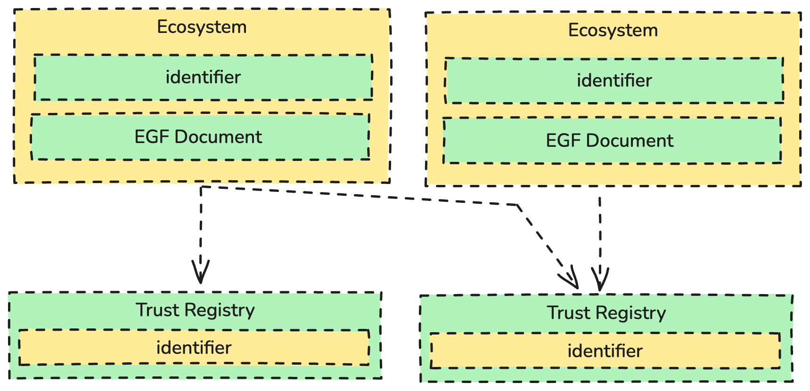
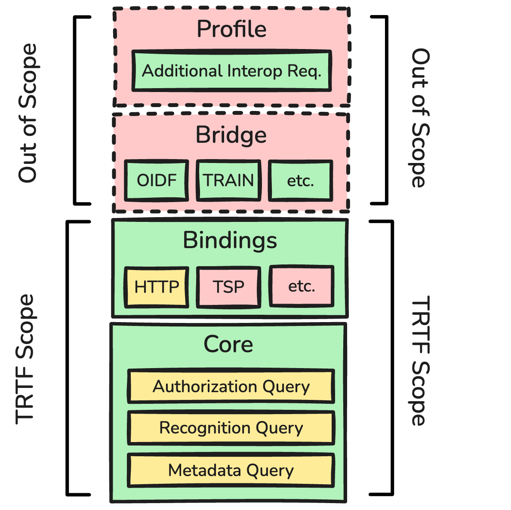
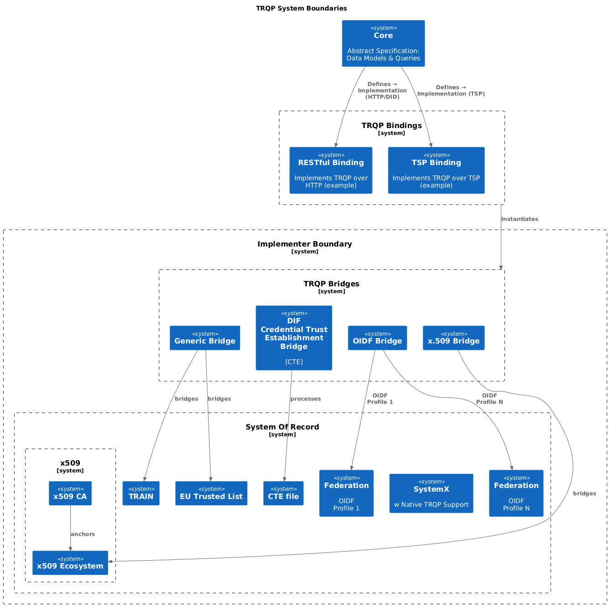

**Trust Registry Query Protocol (TRQP) Overview**
==================

**Specification Status:** Draft
**Version: 1.2:** Draft v1.2 

**Companion Docs**
~ [Core](/v2/core)
~ [Bindings](/v2/bindings)

**Participate:**
~ [GitHub repo](https://github.com/trustoverip/tswg-trust-registry-protocol/tree/main)
~ [File a bug](https://github.com/trustoverip/tswg-trust-registry-protocol/issues)

## Introduction

Many digital ecosystems use intra-ecosystem trust frameworks—for example, OpenID
Federation, X.509 certificate hierarchies, EBSI Trust Chains, or TRAIN—to
confirm whether an entity holds a specific authorization under a given
governance framework. Although these frameworks excel within their own
ecosystems, they often lack native interoperability when verifiers seek to
verify trust and authorization across ecosystems.

The Trust Registry Query Protocol (TRQP) aims to solve this interoperability gap
by acting as an inter-trust framework. It specifies a standardized set of
queries and data models that different ecosystems can implement. This approach
permits verifiers to retrieve information from an external trust registry—even
one based on a completely different internal architecture—without forcing any
ecosystem to abandon or overhaul its existing trust model.

TRQP focuses on three main query types:

1. **Authorization Query:** “Does Entity X hold Authorization Y under Ecosystem
 Z’s governance framework?”
2. **Recognition Query**: “Does Ecosystem A recognize or accept the governance
 framework of Ecosystem B?”
3. **Metadata Query**: “What trust capabilities, data models, or policies does a
 given registry support?”

By standardizing these queries, TRQP ensures that trust verification can be
performed uniformly, even if each ecosystem operates with different governance
logic, cryptographic primitives, and internal policies.

This document provides the overview to the TRQP. For more details, please read the note below:

------------------------------------

## Purpose and Scope

### Purpose

TRQP is designed to foster cross-ecosystem interoperability by providing:

* **A Uniform Query Mechanism**: A minimal but powerful set of request/response structures that any trust registry can implement.
* **Abstraction of Complexity:** Each ecosystem retains the freedom to manage its trust infrastructure, membership databases, or certificate authority in its own way. TRQP standardizes only the interface needed to verify and fetch trust-related data.
* **Practical Integration:** Ecosystems can be integrated using “bridges” or
adapters, preserving existing issuance, revocation, or auditing workflows.

### Scope

1. **Core Queries & Data Models**
 * **Authorization Query**: Confirms or denies that a subject is authorized under a specific ecosystem.
 * **Recognition Query:** Determines whether one ecosystem’s governance framework is recognized by another.
 * **Metadata Query:** Exposes the descriptive information (capabilities, version details, etc.) of a trust registry.

2. **Minimal Interfaces**
 * TRQP specifies a set of abstract interfaces that every compliant trust registry MUST support.
 * Because TRQP is transport-agnostic, these interfaces can be realized via various messaging protocols (e.g., RESTful).

3. **Bindings**
 * Bindings: Provide a concrete mapping of TRQP to a specific transport layer and message format (e.g., RESTful).

## TRQP Trust Networks

A trust network is formed when multiple participants, such as organizations or governance bodies, agree on a common TRQP Profile. This profile can specify:

* **TRQP Bindings :** Concrete implementation details necessary for translating the Core specification into an operational protocol. For example, query a TR under a set of HTTP Endpoints. 
* **Security Requirements:** Minimum TLS versions, required signature algorithms, or permissible key types.
* **Identifier Standards**: Requiring DIDs, X.509 Subject Names, or URIs.
* **Additional Governance Constraints**: Such as specific policy references, trust anchors, or revocation timelines.

By anchoring on a shared profile, a trust network ensures that all participating ecosystems operate with consistent rules and expectations, thus simplifying cross-ecosystem verification.

### **TRQP Core: Ecosystem and Trust Registry Interaction Model**

The **TRQP Core** defines an abstract data model that standardizes how **ecosystems** and **trust registries** interact, ensuring interoperability across diverse governance frameworks.

In this model:

- A **Trust Registry** acts as an authority that manages and serves **authority statements** for one or more ecosystems.  
- **Ecosystems** rely on trust registries to verify the authenticity, validity, and governance of participating entities.  
- **Authority statements** encapsulate verifiable claims about **authorizations, delegations, and ecosystem recognition** forming the foundation of trust across ecosystems.

For a deeper dive into the data models, query mechanisms, and interoperability rules that govern TRQP, refer to the **[Core Specification](/v2/core/)**.

## **TRQP Layer Architecture**

TRQP follows a layered architecture to separate concerns and allow for maximum flexibility across ecosystems with differing technical stacks.

### TRQP Core

* Defines abstract data models (e.g., for authorization, recognition, and metadata).
* Enumerates the required queries to be supported by a compliant registry.
* Outlines security considerations (e.g., signatures, proof mechanisms, revocation handling).

Notably, the Core does not mandate any particular identity format (DID, x.509, etc.) or transport protocol. This design choice reduces friction for existing ecosystems by letting them remain as is internally while exposing TRQP endpoints externally.

### TRQP Binding

* Translates the core queries and data models into a specific transport-layer implementation (e.g., RESTful, DIDComm messaging).
* Defines how requests and responses are structured and encoded (JSON, JSON-LD, JWT).
* Specifies any additional encryption or authentication steps needed to secure transport at runtime (e.g., TLS, message-level signatures, ephemeral keys).

### TRQP Bridge

* Serves as an adapter or connector between an ecosystem’s trust registry and its chosen TRQP Binding.
* Converts external TRQP calls into the internal logic of the trust registry (certificate validation, membership lookups, policy checks, etc.).
* Returns outputs aligned to the defined Binding, allowing for a consistent interpretation of authorization, recognition, and metadata results.

## TRQP Profiles Are Out of Scope But Important Considerations

Although the Core provides a universal framework, many networks need additional implementation constraints or policies to ensure seamless interoperability. This is achieved via TRQP Profiles:

* A Profile may standardize bindings, credential formats, or identity systems.
* It may also refine or extend the security requirements and naming conventions.
* Trust Networks may involve a common anchor on a common profile to guarantee that all participants speak the same “dialect” of TRQP.

Because of these profiles, an ecosystem can easily detect and interoperate with others that share the same trust network or have designated compatibility.

## Next Steps

TRQP offers a unified, minimal protocol for cross-ecosystem trust verification. It standardizes three key queries—Authorization, Recognition, and Metadata—alongside flexible data models. By dividing the specification into a Core, Binding, and Bridge, TRQP maintains a clear separation of concerns and encourages modular adoption:

* Core: Abstract definitions and baseline requirements.
* Binding: Concrete implementation details for a particular transport or message format.
* Bridge: Adapters that connect existing trust frameworks to the standardized TRQP interface.

Trust networks can extend TRQP through profiles, aligning on consistent transport, credential formats, and policy rules to ensure broad interoperability with minimal friction.

**Check out the [Core Specification](/v2/core/) and [Bindings](/v2/bindings/).**

## Implementation Tips

* **Begin with One Binding:** A simple RESTful endpoint often suffices as a proof of concept.
* **Develop or Integrate a TRQP Bridge:** Map queries to existing database or certificate checks, preserving local rules.
* **Adopt a Common Profile:** Align with a trust network’s defined profile to simplify multi-party interoperability.

