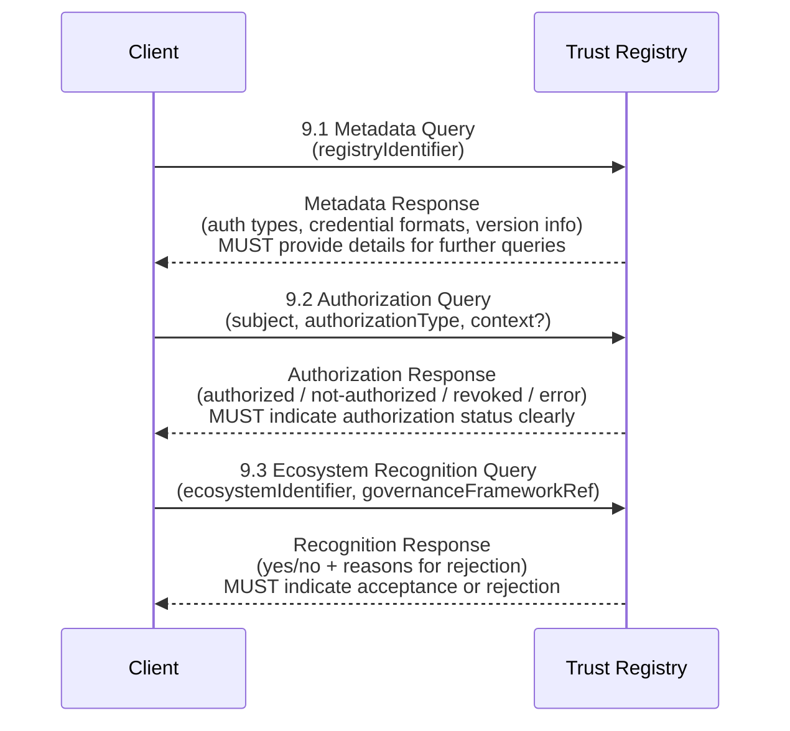

## **Introduction**  
_this section is non-normative_

Modern digital trust ecosystems employ a broad spectrum of **intra-ecosystem** frameworks—such as OpenID Federation, X.509 certificate chains, and EBSI Trust Chains—to manage authorized actors *within* a single governance domain. When it comes to verifying trust **across** different domains, however, no common vocabulary or interface exists. Verifiers seeking to confirm cross-ecosystem authorizations must contend with incompatible data models, inconsistent APIs, and divergent policies. 

The **Trust Registry Query Protocol (TRQP)** closes this interoperability gap by
specifying an **abstract** set of queries and data models that different trust
frameworks can implement. It introduces a standardized “bridge” for verifying
whether an entity or ecosystem is recognized or authorized beyond its original
domain—without mandating that any party revamp its existing internal governance
structure or security model.

### **Who Is This Specification For?**
- **Trust Framework Providers**: Ecosystem operators that manage internal authorization processes (e.g., OpenID, X.509 CAs) but need a consistent way to publish and validate those authorizations to external verifiers. 
- **Verifiers**: Entities that consume cross-ecosystem authorization details—such as relying parties, certification bodies, or auditors—who need a uniform mechanism to inquire about another party’s trust status outside their own ecosystem. 
- **Developers of Interoperability Solutions**: Teams building connectors, gateways, or “bridges” that unify distinct trust frameworks under a single protocol. 
- **Governance Bodies**: Policy-makers and standard-setters who want to ensure that ecosystems can interoperate without forgoing unique governance policies.

### **What the Specification Does (and Does Not) Do**  
- **Does**:
  - **Define** a minimum set of **abstract queries** (Metadata, Authorization,
    Recognition) that any TRQP-compliant trust registry **MUST** implement.
  - **Describe** the data models necessary to exchange trust information
    ([[ref:Authority Statement]], [[ref:System of Record]], etc.).
  - **Enable** cross-ecosystem interoperability by outlining consistent rules
    for how verifiers can inquire about and interpret trust data coming from
    diverse frameworks.

- **Does Not**:
  - **Prescribe** a single transport protocol, messaging format, or cryptographic mechanism. These details are left to a [ref: TRQP Binding], which maps the abstract queries to actual implementations (e.g., REST, DIDComm, etc.).  
  - **Replace or Modify** existing trust frameworks. Instead, TRQP serves as a bridging layer that ecosystems adopt on their own terms.  
  - **Mandate** how governance bodies structure their internal policies or define their recognition relationships. TRQP simply provides a way to *expose* those details in a standardized fashion.

## **Terms and Definitions**
_this section is non-normative_

 [[def:Authority Query, Authority Queries]]
~ A request (typically formal or protocol-based) that seeks to verify whether a
specific entity (subject) holds a particular authorization, credential, or right
within an ecosystem.

 [[def:Authority State, Authority States]]
~ A recorded or asserted status indicating whether an entity currently possesses
a valid authorization within an ecosystem. It reflects the definitive condition
of the entity’s rights or credentials at a given point in time.

 [[def:Authority Statement, Authority Statements]]
~ An authority statement is an assertion by an **authority** about either:
a) the **authorization** or **delegation** it grants to another party over which
it has authority, or b) the **recognition** it gives to a peer about the scope of
that peer’s authority.

 [[def:Digital Trust Ecosystem, Digital Trust Ecosystems]]
~ A [digital ecosystem](https://glossary.trustoverip.org/#term:digital-ecosystem)
in which the participants are one or more interoperating
[trust communities](https://glossary.trustoverip.org/#term:trust-communities).
Governance of the various
[roles](https://glossary.trustoverip.org/#term:roles) of
[governed parties](https://glossary.trustoverip.org/#term:governed-parties)
within a digital trust ecosystem (e.g.,
[issuers](https://glossary.trustoverip.org/#term:issuers),
[holders](https://glossary.trustoverip.org/#term:holders),
[verifiers](https://glossary.trustoverip.org/#term:verifiers),
[certification bodies](https://glossary.trustoverip.org/#term:certification-bodies),
[auditors](https://glossary.trustoverip.org/#term:auditors)) is typically managed
by a [governing body](https://glossary.trustoverip.org/#term:governing-body)
using a [governance framework](https://glossary.trustoverip.org/#term:governance-framework)
as recommended in the [ToIP Governance Stack](https://glossary.trustoverip.org/#term:toip-governance-stack).
Many digital trust ecosystems will also maintain one or more
[trust lists](https://glossary.trustoverip.org/#term:trust-lists) and/or
[trust registries](https://glossary.trustoverip.org/#term:trust-registries).

 [[def:Ecosystem Governance Framework, Ecosystem Governance Frameworks]]
~ A [governance framework](https://glossary.trustoverip.org/#term:governance-framework)
for a [digital trust ecosystem](https://glossary.trustoverip.org/#term:digital-trust-ecosystem).
An ecosystem governance framework may incorporate, aggregate, or reference other
types of governance frameworks such as a
[credential governance framework](https://glossary.trustoverip.org/#term:credential-governance-framework)
or a
[utility governance framework](https://glossary.trustoverip.org/#term:utility-governance-framework).

 [[def:Inter-Ecosystem Trust, Inter-Ecosystem Trusts]]
~ The confidence and assurance established between two or more distinct
ecosystems or governance frameworks. This type of trust enables cross-recognition
of rules, trust registries, and authorization states among separate ecosystems.

 [[def:Intra-Ecosystem Trust Framework, Intra-Ecosystem Trust Frameworks]]
~ The confidence and assurance maintained within a single ecosystem or governance
framework. It applies to entities operating under the same set of rules, trust
registries, and oversight mechanisms.

 [[def:Hierarchical Authority Relationship, Hierarchical Authority Relationships]]
~ A relationship between an authority and another party subject to that authority.
This relationship is unilateral and exclusive, meaning that the authority is the
only one in control, i.e., the only one who can grant authorization to or revoke
authorization from the authorized party.

 [[def:Recognition Relationship, Recognition Relationships]]
~ A heterarchical authority relationship between two authorities who are peers,
each authoritative for their own ecosystems. The relationship between these two
authorities can be either unilateral or bilateral and it is non-exclusive. One
authority is attesting to the other’s authority in one direction or both
directions.

 [[def:Recognition Query, Recognition Queries]]
~ A request to a network that enables a verifier to check the Recognition
Relationship [[ref:Recognition Relationship]] of an ecosystem in relation to
another ecosystem.

 [[def:TRQP Core]]
~ A foundational specification that defines the core data models, queries, and
security requirements necessary for consistent, interoperable trust interactions
across different systems and ecosystems. It sets the universal “language” for
TRQP implementations, ensuring that all compliant solutions share a common
framework for exchanging and validating trust information.

 [[def:TRQP Binding, TRQP Bindings]]
~ A technical specification document outlining the precise requirements for
implementing interoperability via the base TRQP interfaces and data models. It
dictates how systems should interact and exchange trust information to remain
compliant with TRQP standards.

 [[def:TRQP Bridge, TRQP Bridges]]
~ A software or infrastructure component that connects a 
 [[ref:System of Record]] to a specified [[ref:TRQP Binding]],
enabling seamless data exchange and interoperability. It serves as the interface
through which trust and authority data move between the system and the
TRQP-compliant environment.

 [[def:System of Record, Systems of Record]]
~ An authoritative source that manages and maintains authority and recognition
statuses for participants within an ecosystem. It is responsible for preserving
the integrity and continuity of records, including authorizations and trust
credentials.

### **Scope of This Specification**  
_this section is non-normative_

This specification primarily defines the **TRQP Core**, which establishes the
normative **data models** and **query semantics** required for cross-ecosystem
trust verification. While TRQP is designed to be transport-agnostic, this
document also specifies an **initial RESTful TRQP Binding**, providing a
concrete mapping of TRQP queries to a widely adopted web API standard.

A **TRQP Binding** extends the core abstractions by specifying how TRQP queries
should be transmitted over a given protocol. In the case of the RESTful binding:
- **Queries** (such as Authority Queries, Recognition Queries, and Metadata
  Queries) are mapped to HTTP endpoints.
- **Requests and responses** follow structured JSON representations, ensuring
  machine-readable and interoperable exchanges.
- **Security and authentication mechanisms** are left to ecosystem-specific
  implementations but must align with the core TRQP security model.

The role of **TRQP Bridges**, which connect an implementation to a specific
**System of Record**, is recognized but left **out of scope** for this
specification. Implementers are free to define how their internal trust
registries, governance frameworks, or ledger-based systems integrate with
TRQP-compliant endpoints.

### **Out of Scope**

- **Routing and Discovery**: While TRQP specifies structured queries, it does not define how verifiers discover registries or how requests should be routed to the appropriate authority. Ecosystems may implement their own directory services or resolution mechanisms.  
- **Protocol-Specific Variants**: While this document defines a RESTful binding, additional bindings (e.g., DIDComm, gRPC) may be created separately and are not covered here.  
- **Governance and Policy Decisions**: TRQP does not mandate specific governance policies but provides a mechanism for ecosystems to expose their existing policies in a structured and queryable manner.  

This approach ensures that TRQP remains **flexible and extensible**, allowing
different ecosystems to adopt it in a way that aligns with their existing trust
models while still ensuring cross-framework interoperability.

Fig 1: This specification is focused specifically on addressing the core
requirements for a binding specification to be TRQP compliant. It is up to
ecosystems to build their own bindings.

::: note
For more background information, please see the [wiki](https://lf-toip.atlassian.net/wiki/spaces/HOME/pages/22996548/ToIP+Trust+Registry+Query+Protocol+TRQP+Specification+Overview). The wiki describes the ecosystems of ecosystems model and the core considerations for the TRQP.
:::

## **Problem Statement**
_this section is non-normative_

Modern digital ecosystems often rely on **[[ref:Intra-Ecosystem Trust Framework]]** (e.g., OpenID Federation, X.509 Chains, EBSI
Trust Chains, TRAIN) to manage authorization within their own boundaries. While
these frameworks are effective at validating whether an entity is authorized
**within** a single ecosystem, they do not easily extend to other ecosystems. As
a result, organizations face considerable challenges when attempting to verify
authorizations **across** different frameworks. The core issues include:

* **Siloed Trust Frameworks**: Each ecosystem typically operates in isolation,
  lacking a common or standardized method to verify whether a subject in one
  ecosystem has valid authorization recognized by another.
* **Inconsistent Interfaces**: Every ecosystem defines its own APIs, credential
  formats, and governance rules, which forces implementers to work with multiple
  disparate interfaces and data models.

When attempting to establish **[[ref:Inter-Ecosystem Trust Framework]]**,
verifiers face two fundamental questions:

1. **Ecosystem Recognition**:

   *“Do I recognize the governance framework [[ref:Ecosystem Governance Framework]]
   of the other ecosystem?”*

   This question, also called “ecosystem recognition,” is inherently complex and
   ultimately depends on human policy decisions. It is not easily automated.

2. **Entity Authorization**:

   *“Is the issuer authorized to issue this type of data under the ecosystem’s
   governance framework [[ref:Ecosystem Governance Framework]]?”*

   This question takes the form of an **[[ref:Authority Query]]**,
   which is a formal or protocol-based request to confirm whether a given entity
   (subject) holds a specific authorization, credential, or right within the
   ecosystem.

Figure 2: The two fundamental queries required cross-ecosystem authority
verification.

TRQP tackles the [[ref:Inter-Ecosystem Trust Framework]] problem
by allowing verifiers outside an ecosystem to request an
**[[ref:Authority Query]]** and **[[ref:Recognition Query]]** to any TRQP compliant network. The specification
must work independently of any particular Systems of Record [[ref:System of Record]]
and intra-trust frameworks, ensuring trust can be established across different
ecosystems without uplifting a current authority system.

## **High-Level Architecture**
_this section is non-normative_

The **TRQP** architecture is designed to enable standardized cross-ecosystem
queries regarding trust registry information, authorization, and recognition. At
its heart, TRQP comprises:

1. An **abstract specification** (the *Core*) defining data models, query flows,
   and security considerations. (i.e. **[[ref:TRQP Core]]**)
2. One or more **concrete bindings [[ref:TRQP Binding]]** that map the abstract
   specification to specific transport protocols (e.g., HTTPS, DIDComm, TSP).
3. **[[ref:TRQP Bridge]]** that connect TRQP queries to particular trust
   frameworks (OIDF Federation, x.509, etc.).
4. **[[ref:System of Record]]**—the actual trust frameworks or
   registries (e.g., x.509 Ecosystem, OIDF Federation) responsible for issuing
   or validating trust information.

This layered approach allows implementers to select or build only what they
need. If a trust framework has not implemented TRQP, integrators can connect a
new **[[ref:TRQP Bridge]]** to a **[[ref:TRQP Binding]]** for it,
as long as they follow the core specification and a compatible binding. The spec
focuses on the abstract specification layer *(i.e Core)* and will not go into
detail on anything lower in the stack.

Fig 3: TRQP Architecture has three layers: Core, Bindings, and Bridges.

Details of *[[ref:TRQP Bridge]]*, *[[ref:System of Record]]*,
and *[[ref:TRQP Binding]]* are out of scope for this specification, but
defined in concept for other specifications to describe in detail.

We will briefly go through each of the layers at a high level, and expand on the
**[[ref:TRQP Core]]** layer in more detail in the subsequent
section.

### **TRQP Core**
_this section is non-normative_

* **What it is**: The [[ref:TRQP Core]] is an **abstract** specification
  that defines:
  * **Data Models**: Metadata, authorization, ecosystem recognition, etc.
  * **Required Queries**: MetadataQuery, AuthorizationQuery, and
    EcosystemRecognitionQuery.
* **Role**: It ensures every TRQP-based implementation speaks the same
  “language” (even if actual messages go over different transports).

### **TRQP Binding**
_this section is non-normative_

* **What is it**: Concrete mappings of the Core specification onto specific
  transports and protocols. For example:
  * **RESTful Binding**: Illustrates how to send TRQP queries over HTTPS.
* **Role**: A [[ref:TRQP Binding]] ensures that an abstract query
  from the Core spec is transformed into real network requests and responses in
  a standardized way.

### **TRQP Bridges**
_this section is non-normative_

* **What they are**: Adapters or connectors that apply a chosen
  [[ref:TRQP Binding]] to a specific trust framework (x.509, OIDF, DIF
  CTE, etc.).
* **Examples**:
  * **x.509 Bridge**: Translates TRQP queries into x.509 certificate validations
    and chain checks.
  * **OIDF Bridge**: Leverages OpenID Federation endpoints to answer TRQP queries
    about OIDC-based trust relationships.
  * **CTE Bridge**: Adapts TRQP queries to DIF’s Credential Trust Establishment
    protocols.
* **Role**: A [[ref:TRQP Bridge]] “bridges” existing frameworks into
  TRQP by implementing the relevant [[ref:TRQP Binding]] and mapping
  framework-specific data.

### **Systems of Record**
_this section is non-normative_

* **Definition**: Real-world trust frameworks or registries storing authoritative
  data. Examples include:
  * **OIDF Federation** (Profiles 1, N)
  * **x.509 Ecosystem** (with a CA and certificate hierarchy)
  * **TRAIN** (some trust registry or network)
  * **EU Trusted List** (an EU-level trust list or EBSI-based registry)
* **Role**: The ultimate source of truth for whether an entity is recognized,
  authorized, or otherwise valid within a particular ecosystem. (i.e.
  **[[ref:System of Record]]**)

## **Interpretation of the Diagram: Ecosystem and Trust Registry Relationship**
_this section is non-normative_

Fig 4: A trust registry may serve an ecosystem Authority Statement. A trust registry may serve multiple ecosystems. An ecosystem may have multiple trust registries.

Each Ecosystem is represented by a yellow box in the diagram and consists of:

* An identifier (green box) – A globally unique reference that distinguishes the
  ecosystem.
* An EGF Document (green box) – The Ecosystem Governance Framework
   [[ref:Ecosystem Governance Framework]] (EGF), which defines governance terms,
  policies, and operational rules for the ecosystem.

The dashed arrows from these Ecosystems point to one or more Trust Registries
below, indicating that:

* Each Ecosystem explicitly references the Trust Registry(ies) it recognizes for
  managing and verifying authority-related queries [[ref:Authority Query]].
* Trust Registries are designated by the Ecosystem metadata and are responsible
  for enforcing the rules and policies outlined in the EGF document.

Each Trust Registry (represented as a green box in the lower row) consists of:

* An identifier (yellow box) – A unique reference for the registry.
* References to one or more Ecosystems – If supported by the metadata, a Trust
  Registry may explicitly list the Ecosystem(s) it serves.

### **Role of the Trust Registry in Ecosystem Governance**
_this section is non-normative_

A Trust Registry manages and serves authority statements [[ref:Authority Statement]]
across one or more Ecosystems by:

* Maintaining a structured record of trust relationships – storing authoritative
  data on recognized entities and their authorization statuses.
* Handling authority queries [[ref:Authority Query]] (as described in Section 8)
  – providing verified responses regarding entity recognition and authorization.
* Operating under the governance of the ecosystem – with the governing body
  defining the policies and processes for registering entries into the ecosystem.

### **Scalability and Multi-Ecosystem Trust Registries**
_this section is non-normative_

* A single Trust Registry may serve multiple Ecosystems, acting as a shared
  infrastructure for trust and authorization across different governance models.
* An Ecosystem may rely on multiple Trust Registries to provide redundancy,
  distribute authority management, or allow for diverse verification approaches.
* The Trust Registry is not independent but operates within the authority scope
  defined by the EGF Document of each ecosystem it serves.

## Metadata Models
_this section is normative_

The following section outlines the metadata model requirements necessary for any bridge implementing TRQP.  

While the previous section introduced key metadata model concepts, the details provided here define their implementation. A crucial aspect of this model is the **1:many relationship** between an **ecosystem and its trust registries**—where an ecosystem may reference multiple trust registries, and a trust registry may serve multiple ecosystems.

### **Trust Registry**
_this section is normative_

* **Properties**
  * **id: MUST** be a globally unique identifier for the registry (e.g., URI,
    DID, UUID).
  * **ecosystem: SHOULD** indicate which ecosystem(s) the registry serves or
    recognizes.
  * **controller: SHOULD** reference the entity (individual, organization, or
    automated system) that manages or operates the registry.

### **Ecosystem**
_this section is normative_

* **Properties**
  * **id: MUST** be a globally unique identifier for the registry (e.g., URI,
    DID, UUID).
  * **egf_id: MUST** specify a *resolvable* EGF identifier referencing the
    official EGF document or descriptor.
  * **trustregistries: MUST** provide a list of authorized Trust Registries that
    serve the ecosystem authority state [[ref:Authority State]].
    * Each registry **MUST** have the following properties:
      * **endpoint**: The address (URL, DID, etc.) for TRQP
        queries [[ref:Authority Query]] /  [[ref:Recognition Query]].
    * Each registry **MAY** also be scoped to a particular set of authorization
      states and is defined in the [[ref:TRQP Binding]].
  * **controller: SHOULD** include a method of validating controllers of an
    ecosystem.

## **Baseline Requirements For Conformance**

### **Trust Registry**
_this section is normative_

* All TRQP registriesqueries **MUST** provide an addressable endpoint that can be
  resolvable as defined by the Implementation Profile.
* All Trust Registries **MUST** supply the required interfaces described in
  Section 8 over the *same* addressable endpoint to be TRQP conformant.

### **TRQP Binding**
_this section is normative_

* All compliant binding [[ref:TRQP Binding]] **MUST** support the required
  interfaces described in Section 8.
* A compliant binding [[ref:TRQP Binding]] **MUST** be compliant with
  TRQP Core [[ref:TRQP Core]] requirements.
* A compliant binding [[ref:TRQP Binding]] **MUST** support versioning using
  [Semantic Versioning 2.0](https://semver.org/)

## **Required Interfaces**
_this section is normative_

Below are abstract API methods that **MUST** be exposed;
**[[ref:TRQP Binding]]** **MUST** define a binding (e.g., REST, gRPC,
DIDComm) that maps these methods to actual endpoints.

### **Metadata Query**
_this section is normative_

* **Request**:  
  There are no mandatory request parameters.  
  * Optionally, an `ecosystem_id` can be supplied to indicate that the metadata request should be interpreted within the context of a specific ecosystem’s governance framework (see [[ref:Ecosystem Governance Framework]]).

* **Response**:  
  * `id`: string. This value uniquely identifies the registry. If an `ecosystem_id` is provided, the response should clearly reflect that the returned data is scoped to the specified ecosystem (e.g., "ecosystem A").

### **Authorization Query**
_this section is normative_

* **Request**:
  * **ecosystem_id**: string. This must be an ecosystem identifier as defined in the TRQP Binding.  
    - *Example*: `"ecosystem_id": "ecosystem A"`
  * **authorization_id**: string. This must match one of the defined authorization types in the TRQP Binding.  
    - *Example*: `"authorization_id": "credential-A-issuer"`
  * **entity_id**: string. This identifier specifies the entity for which the authorization is being queried.  
    - *Example*: `"entity_id": "random-id-1234"`
  * **time**: string (optional). May be provided according to the TRQP Binding guidelines and describes the time at which the Trust Registry should evaluate the authority query.
    * If supplied, the `time` value must adhere to the required time format (e.g., RFC3319 UTC).
    * If omitted, the system must use the current time and include that timestamp in its response.

* **Response**:  
  A status indicating the entity's authorization, such as:
  - **authorized**
  - **not-authorized**
  - **revoked**
  - **unknown-subject**
  - **error**  
  Optionally, the response may include additional details on validity or supporting proof references.

* **Behavior**:  
  The system **MUST** clearly indicate whether the subject holds the specified authorization.

### **Ecosystem Recognition Query**
_this section is normative_

* **Request**:
  * **ecosystem_id**: string. This is the identifier for the ecosystem, defined in the TRQP Binding.  
    - *Example*: `"ecosystem_id": "ecosystem A"`
  * **target_ecosystem_id**: string (optional). This may be another ecosystem identifier against which recognition is being evaluated.
  * **scope**: string (optional). This parameter may be used to filter or narrow the request. The specification does not enforce a specific structure for scopes, but individual profiles may define their own conventions.
  * **time**: string (optional). May be provided as described in the TRQP Binding guidelines.

* **Response**:  
  The response indicates the recognition status of the ecosystem, for example:
  - **accepted** (if the ecosystem is recognized)
  - **rejected** (if it is not)  
  Additional supporting details, such as proof references or log entries, may also be included.

* **Behavior**:  
  The system **MUST** return a clear yes/no answer regarding ecosystem recognition, and it **MAY** provide further explanation or details as specified in the TRQP Binding.
